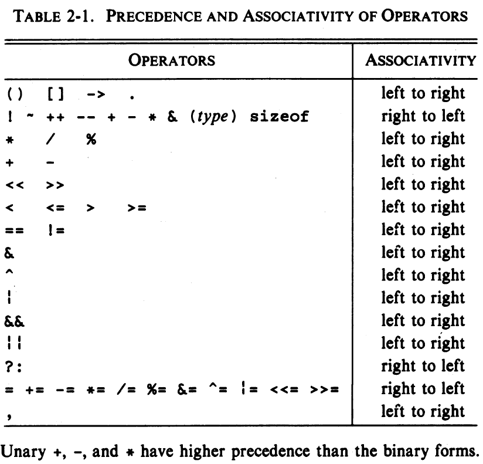

# Types, Operators, and Expressions

- Name of variables and constants are made of letters and numbers, but **first character** must be **letter**. Also C language is **case-sensitive**.
- Traditional C practice uses lower-case characters for **variables**, and all upper-case characters for **symbolic constants**

- Keywords are reserved, so they cant be used. 

- Short names for **local variables**, and longer names for **external variables** is used.

### Data Types 
- Only few basic data types are used in C
    1. <code>char :</code>A single byte, capable of holding one character in the local character set
    2. <code>int :</code>An integer, typically reflecting the natural size of integers on the host machine
    3. <code>float :</code>Single-Precision floating point
    4. <code>double : </code>Double-Precision floationg point

- There are also qualifiers could be applied to these basic types : <code>short, long, signed, unsigned</code>

### Constants
- Suffix for <code>unsigned long</code> : **ul** or **UL**
- Suffix for <code>float</code> : **f** or **F**

``` C
#define VTAB '\013'         /* ASCII Veritcal tab in octal representation */
#define BELL '\007'         /* ASCII bell character in Octal representation */
```

``` C
#define VTAB '\xb'          /* ASCII vertical tab in hex representation */
#define BELL '\x7'          /* ASCII bell character in hex representation */
```

- enumeration variables offer the chance of checking and so are often better than #defines

### Declarations
- <code>const</code> qualifier can be applied to variables declarations, to specify that its value will not be changed. It can be used also with arrays, to indicate that the function **does not** change that array

### Arithmetic Operators
- Modulus operator <code>cannot be</code> applied to float or double.

### Relational and Logical Operators
- Relational operators have lower precendence than arithmetic operators.

### Type Conversion
- If either operand is **long double**, convert other to long double
- If either operand is **double**, convert other to double
- If either operand is **float**, convert other to float
- If either operand is **long**, convert other to long

- Argument of function call is expression, **type conversions** also takes place when arguments are passed to functions.

- With <code>(type name) expression</code> syntax, we can force type conversions. When casting, variable itself not changed.

### Increment and Decrement Operators
- Increment, Decrement operators can be used as postfix or prefix. Using with expressions are **illegal**.


### Bitwise Operators
- Bitwise operators :
    1. Bitwise AND              -> **&**                     
    2. Bitwise Inclusive OR     -> **|**
    3. Bitwise Exclusive OR     -> **^**
    4. Left Shift               -> **<<**
    5. Right Shift              -> **>>**
    6. One's Complement(Unary)  -> **~**


### Assingment Operators and Expressions
- Syntax :  <code>expr1 op= expr2</code>  is Equivalent to <code>expr1 = (expr1) op (expr2)</code> 


### Conditional Expressions
- Ternary operator : <code> expr1 ? expr2 : expr3; is equivalent to 
``` C
if(expr1)
    expr2;
else
    expr3;
``` 

### Precedence and Order of Evaluation

- Bitwise operators(**&**, **^**, **|**) predence falls below **==** and **!**, so when used together, they must be covered by paranthesis,

