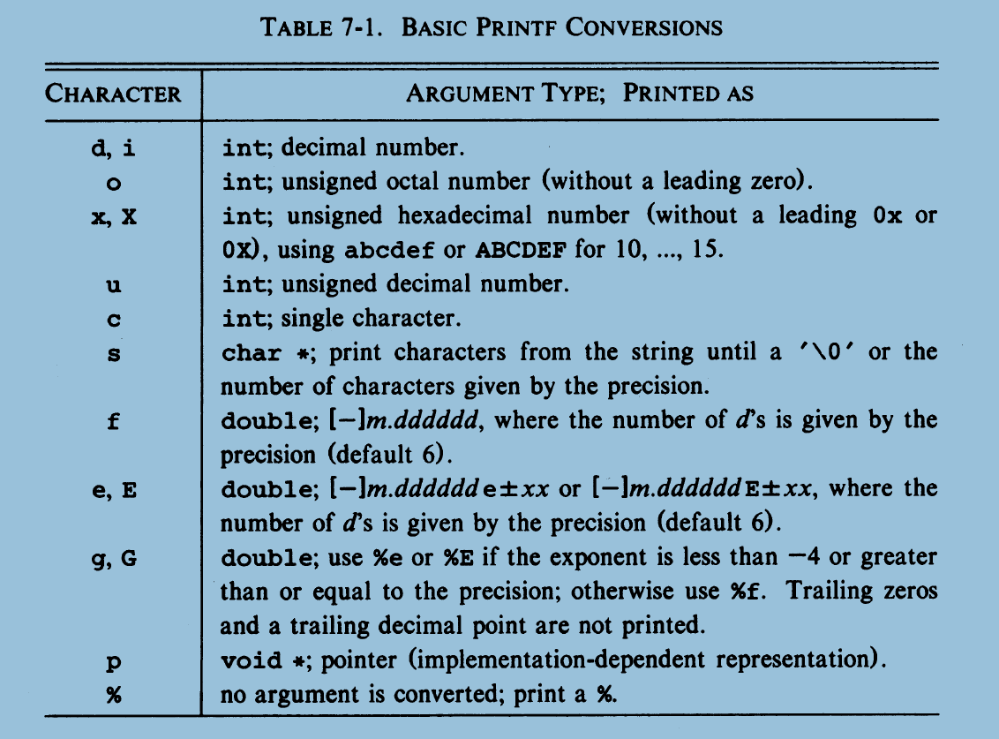
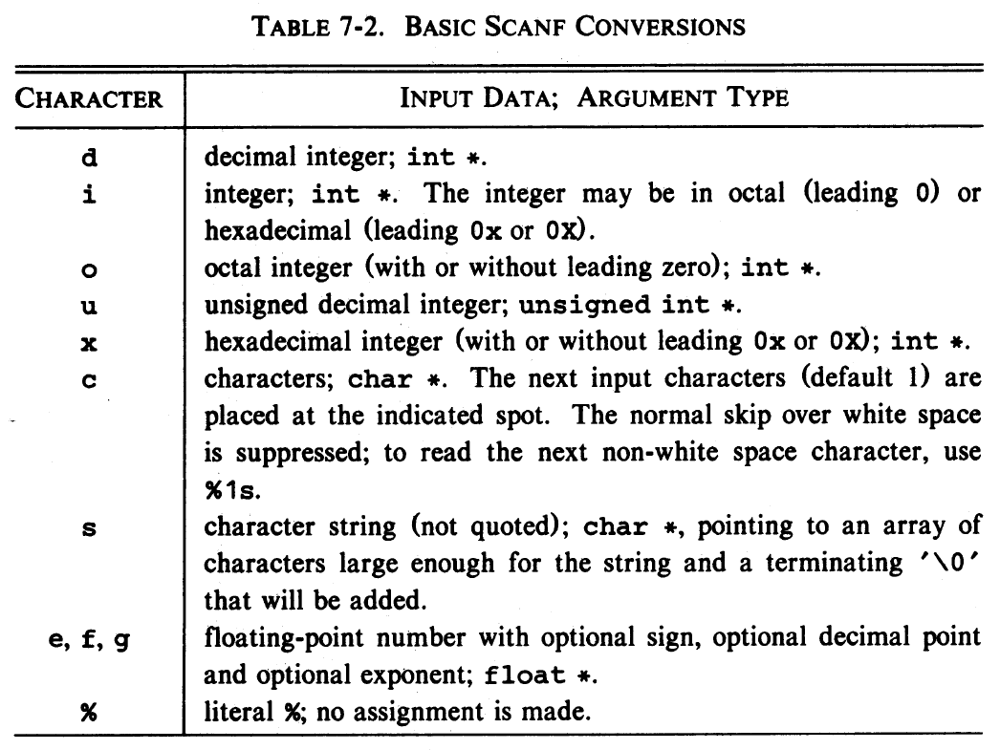

# INPUT and OUTPUT
- Input and Output facilities are not part of the C language itself.

## Standart Input and Output
- We can write or read standart I/O.

## Formatted Output - Printf
- Syntax : <code>int printf(char *format, arg1, arg2, ...);</code>



- Also there is <code>int sprintf(char *string, char *format, arg1, arg2, ...);</code>

## Variable - Length Argument Lists
- In this section, will implement minimal implementation of printf using stdarg.h

## Formatted Input - Scanf
- Syntax : <code>int scanf(char *format, ...);</code> -> Reads from standart Input
- Also there is <code>int sscanf(char *string, char *format, arg1, arg2, ...);</code> -> Reads from string, instead of standart Input.



## File Access
- To access files, there is standart API by stdio.h file. We can use that.

- Prototypes :
``` C
// file pointer to use it with file IO
FILE *fp;
// To open files
FILE *fopen(char *name, char *mode);
// returns next character from file
int getc(FILE *fp);
// writes the character c to file
int putc(int c, FILE *fp);

// To read formatted input
int fscanf(FILE *fp, char *format, ...);
// To write formatted output
int fprintf(FILE *fp, char *format, ...);
// To close given file.
int fclose(FILE *fp);
// for error handling
int ferror(FILE *fp);
// end of file checker.
int feof(FILE *fp);
```

- When a C program is started, the operating system environment is responsible for opening three files, and providing file pointers to them. These files are standart **standart input**, **standart output** and **standart error**. Pointers to this files are, **stdin**, **stdout** and **stderr**, declared in <stdio.h>

- Normally **stdin** connected to keyboard, **stdout** are connected to the screen. But could be redirected to files or pipes.

- <code>getchar()</code> and <code>putchar()</code> defined in terms of <code>getc</code>, <code>putc</code>, <code>stdin</code> and <code>stdout</code>.
``` C
#define getchar()           getchar(stdin)
#define putchar(c)          putc((c),stdout)
```


## Error Handling - Stderr and exit
- For some reason errors could occur during file operation, for that reason some error message could be printed via using stderr.
- Especially stderr is usefull when pipes is used, because the program will evaluate errors is not the program we created but the program is connected to via pipes.

- <code>exit()</code> could be called from anywhere. Thats make it so usefull to use it nested function calls.

## Line Input and Output
- Standart library provides input routine that similiar to getline.
``` C
// Read line. 
char *fgets(char *line, int maxline, FILE *fp);
// Write Line
int fputs(char *line, FILE *fp);

```
## Miscellaneous Functions
### String Operations
``` C
/* s and t are char * type, c and n are ints. */
/* This functions are provided by <string.h> file */

//concatenate t to end of s
char* strcat(s, t);       
// concatenate n characters of t to end of s
char* strncat(s, t, n);
// return negative zero or positive for s < t, s == t or s > t
int strcmp(s, t);
// same as strcmp but only in first n characters
int strncmp(s, t, n);
// copy t to s
char* strcpy(s, t);
// copy at most n characters of t to s
char *strncpy(s, t, n);
// return length of s
int strlen(s);
// return pointer to first c in s, or NULL if not present
char *strchr(s, c);
// return pointer to last c in s, or NULL if not present
char *strrchr(s, c);
```

### Character Testing and Conversion
``` C
/* c is int, and can be represented as unsigned char or EOF */
/* this functions are provided by <ctype.h> header. */

// non-zero if c is alphabetic, 0 if not
int isalpha(c);
// non-zero if c is upper-case, 0 if not
int isupper(c);
// non-zero if c is lower case, 0 if not
int islower(c);
// non-zero if c is digit, 0 if not
int isdigit(c);
// non-zero if isalpha(c) or isdigit(c), 0 if not
int isalnum(c);
// non-zero if c is blank, tab, newline, return, formfeed, vertical tab
int isspace(c);
// return c converted to upper case
int toupper(c);
// return c converted to lower case
int tolower(c);
```

- With function <code>system(char *)</code> can be executed as its from command line.


### Mathematical Functions

``` C
/* each functions takes double input and returns double */
/* this functions are provided by <math.h> header file */

// sine of x, x in radians
double sin(double x);
// cosine of x, xin radians
double cos(double x);
// arctangent of y/x, in radians
double atan2(double x, double y);
// exponential function e of x
double exp(double x);
// natural(base e) logarithm of x (x > 0)
double log(double x);
// common(base 10) logarithm of x (x > 0)
double log10(double x);
// x over y
double pow(double x, double y);
// square root of x (x > 0)
double sqrt(double x);
// absolute value of x
double fabs(double x);
```
- Also we could use some random number generator to genereate float numbers between 0 and 1.
``` C
#define frand()     ((double)rand() / (RAND_MAX));
```