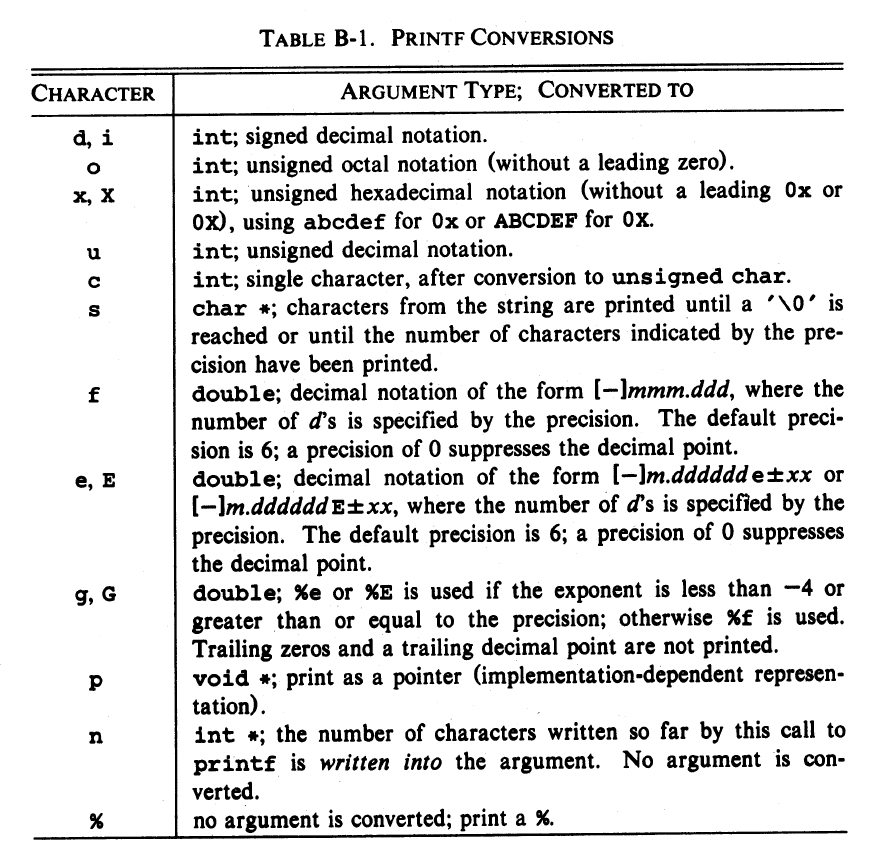
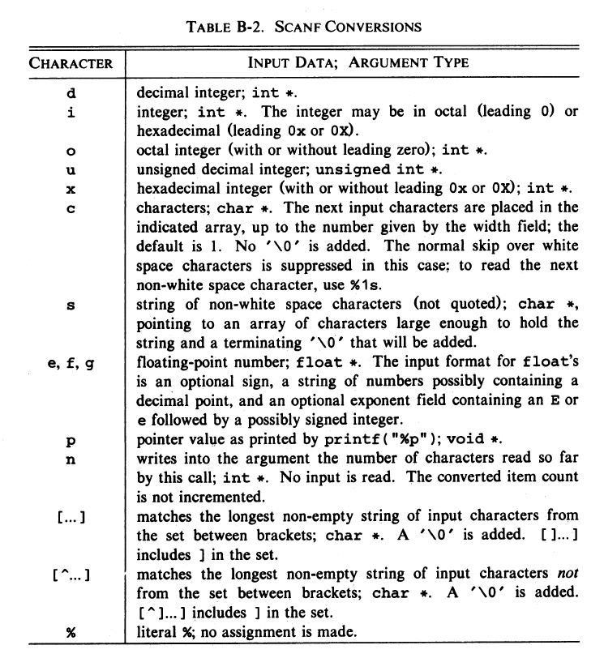
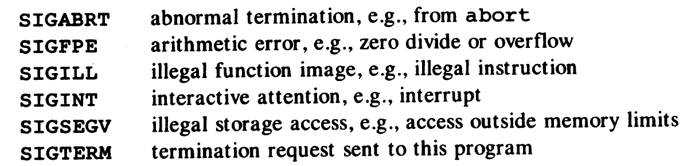

# STANDART LIBRARY
- The standart library is not part of the C language proper, but an environment that support standart C will provide the function declarations and type and macro definitions of this library.
- Standart Libraries
    | assert.h  	| float.h  	| math.h   	| stdarg.h 	|
    |-----------	|----------	|----------	|----------	|
    | stdlib.h  	| ctype.h  	| limits.h 	| setjmp.h 	|
    | stddef.h  	| string.h 	| errno.h  	| locale.h 	|
    | signal.h  	| stdio.h  	| time.h   	|          	|

## Input and Output -> <stdio.h>
- The I/O functions, types and macros defined in stdio.h represent nearly one third of the library.
- A stream is source or destination of data that may be associated with a disk or other peripheral. 
- The library supports text streams and binary streams, allthough on some systems these are identical
- A stream is connected to a file or device by **opening** it, connection is broken by **closing** the stream.
- Opening file returns a pointer to an object of type FILE, which recordsw hatever information is necessary to control the stream.
- When a program begins execution, the three streams **stdin**, **stdout**, **stderr** are already open.

### File Operations
- <code>FILE *fopen(const char *filename, const char *mode)</code> : Opens file
- <code>FILE *freopen(const char *filename, const char *mode, FILE *stream)</code> : Opens file and associates stream with it
- <code>int fflush(FILE *stream)</code> : On an output stream, fflush causess any buffered but unwritten data to be written
- <code>fclose(FILE *stream)</code> : fclose flushes any unwritten data for stream, discards any unread buffered input, then closes the stream
- <code>remove(const char *filename)</code> : removes the named file.
- <code>rename(const char *oldname, const char *newname)</code> : Changes the name of file.
- <code>FILE *tmpfile(void)</code> : Creates a temporary file of mode, that will be automatically removed when closed.
- <code>char *tmpnam(char s[L_tmpnam]) : Creates string that is not the name of existing file.
- <code>int setvbuf(FILE *stream, char *buf, int mode, size_t size)</code> : Controls buffering for the stream.
- <code>void setbuf(FILE *stream, char *buf)</code> : If buf is NULL, buffering turned off for the stream

### Formatted Output
- <code>fprintf(FILE *stream, const char *format, ...)</code> : fprintf converts and writes output to stream under the control of format.

- <code>int printf(const char *format, ...)</code> : printf is equivalent to fprintf(stdout, ...)
- <code>int sprintf(char *s, const char *format, ...)</code> : It is same as printf except that the output is written to string.
- <code>vprintf(const char *format, va_list arg)</code>, <code>vfprintf(FILE *stream, const char *format)</code>, <code>vsprintf(char *s, const char *format, va_list arg)</code> : This functions are equivalent to printf functions.

### Formatted Input
- scanf functions deal with formatted input conversion
- <code>fscanf(FILE *stream, const char *format, ...)</code> : fscanf reads from stream under control of format.

- <code>int scanf(const char *format, ...)</code> : scanf is identical to fscanf(stdin, ...).
- <code>int sscanf(char *s, const char *format, ...)</code> : sscanf is equivalent to scanf except that input characters are taken from the string s.

### Character Input and Output Functions
- <code>int fgetc(FILE *stream)</code> : fgetc returns the next character of stream as an unsigned char, or EOF if end of file or error occurs.
- <code>char *fgets(char *s, int n, FILE *stream)</code> : fgets reads at most the next n-1 characters into array s.
- <code>int fputc(int c, FILE *stream)</code> : fputc writes the characters on stream.
- <code>int fputs(const char *s, FILE *stream)</code> : fputs writes the string s on stream.
- <code>int getc(FILE *stream)</code> : getc is equivalent to fgetc except that if it is a macro.
- <code>int getchar(void)</code> : getchar is equivalent to getc(stdin)
- <code>int *gets(char *s)</code> : gets reads the next input line into the array s.
- <code>int putc(int c, FILE *stream)</code> : putc is equivalent to fputc except that if it is a macro.
- <code>int putchar(int c)</code> : putchar is equvalent to putc(c, stdout)
- <code>int puts(const char *s)</code> : puts writes the string s and a newline to stdout.
- <code>int ungetc(int c, FILE *stream) : ungetc pushes c back onto stream.

### Direct Input and Output Functions
- <code>size_t fread(void *ptr, size_t size, size_t nobj, FILE *stream)</code> : fread reads from stream in the array ptr at most nobj objects of size size.
- <code>size_t fwrite(const void *ptr, size_t size, size_t nobj, FILE *stream)</code> : fwrite writes, from the array ptr, nobj objects of size size on stream.

### File Positioning Functions
- <code>int fseek(FILE *stream, long offset, int origin)</code> : fseek sets the file position for stream.
- <code>long ftell(FILE *stream)</code> : ftell returns the current file position for sstream.
- <code>void rewind(FILE *stream)</code> : is equivalent to fseek(fp, 0L, SEEK_SET);
- <code>int fgetpos(FILE *stream, fpost_ *ptr)</code> : fgetpos records the current position in stream in *ptr.
- <code>int fsetpos(FILE *stream, const fpos_t *ptr)</code> : fsetpos positions stream at the position recorded by fgetpos in *ptr

### Error Functions
- Many of the functions in library set status indicators when error or end of file occur. These indicators may be set and tested explicitly. in errno.h error numbers are contained.
- <code>void clearerr(FILE *stream)</code> : clears the end of file and error indicators from stream.
- <code>int feof(FILE *stream)</code> : Returns non-zero if the end of file indicator from stream is set.
- <code>int ferror(FILE *stream)</code> : ferror returns non-zero if the error indicator for stream is set.
- <code>void perror(const char *s)</code> : perror(s) prints s and an implementation-defined error message corresponding to integer.

## Character Class Tests -> <ctype.h>
- Declares functions for testing characters. For each function the argument is an int. 
    1. <code>isalnum(c)</code> : isalpha(c) or isdigit(c) is true
    2. <code>isalpha(c)</code> : isupper(c) or islower(c) is true
    3. <code>iscntrl(c)</code> : control character
    4. <code>isdigit(c)</code> : decimal digit
    5. <code>isgraph(c)</code> : printing character except space
    6. <code>islower(c)</code> : lower-case letter
    7. <code>isprint(c)</code> : is printable character including space
    8. <code>ispunct(c)</code> : printing character except space or letter or digit
    9. <code>isspace(c)</code> : space, fromfeed, newline, carriage return, tab, vertical tab
    10. <code>isupper(c)</code> : upper-case letter
    11. <code>isxdigit(c)</code> : hexdecimal digit

- In addition
    1. <code>int tolower(int c)</code> : Convert c to lower-case
    2. <code>int toupper(int c)</code> : convert c to upper-case

## String Functions -> <string.h>
- There are two groups of string functions defined in the header string.h
- <code>char *strcpy(s, ct)</code> : copy string ct to string s, including NULL, return s
- <code>char *strncpy(s,ct,n)</code> : copy at most n characters of string ct to s, return s
- <code>char *strcat(s, ct)</code> : concatenate string ct to end of string s, return s
- <code>char *strncat(s, ct, n)</code> : concatenate at most n characters of string ct to string s, Including NULL, return s
- <code>int strcmp(cs, ct)</code> : compare string cs to string ct
- <code>int strncmp(cs, ct, n)</code> : compare at most n charaters of string cs to string ct
- <code>char *strchr(cs, c)</code> : return pointer to first occurence of c in cs or NULL
- <code>char *strrchr(cs, c)</code> : return pointer to last occurence of c in cs or NULL
- <code>size_t strspn(cs, ct)</code> : return length of prefix of cs consisting of characters
- <code>size_t strcspn(cs, ct)</code> : return length of prefix of cs consisting of charaters not in ct
- <code>char *strpbrk(cs, ct)</code> : return pointer to first occurence in string cs of any charaters of string ct.
- <code>char *strstr(cs, ct)</code> : return pointer to first occurence of string ct in cs.
- <code>size_t strlen(cs)</code> : return length of cs.
- <code>char *strerror(n)</code> : return pointer to implementation-defined string corresponding to error n
- <code>char *strtok(s, ct)</code> : strtok searches s for tokens delimited by characters from ct.

- The mem... functions are meant for manipulating objects as character arrays.
- <code>void *memcpy(s, ct, n)</code> : copy n characters from ct to s and return s
- <code>void *memmove(s, ct, n)</code> : same as memcpy except that it works even if the objects overlap
- <code>int memcmp(cs, ct, n)</code> : compare the first n charaters of cs with cs, return as with strcmp
- <code>void *memchr(cs, c, n)</code> : return pointer to first occurence of charater c in cs, or NULL if not present among the first n characters
- <code>void *memset(s, c, n)</code> : place character c into first n characters of s, return s;

## Mathematical Functions -> math.h
- The header math.h declares mathematical functions and macros.
- <code>sin(x)</code> : sine of x
- <code>cos(x)</code> : cosine of x
- <code>tan(x)</code> : tangent of x
- <code>asin(x)</code> : inverse of sin of x
- <code>acos(x)</code> : inverse of cos of x
- <code>atan(x)</code> : inverse of tan of x
- <code>atan2(x)</code> : inverse of tan of y over x
- <code>sinh(x)</code> : hyperbolic sine of x
- <code>cosh(x)</code> : hyperbolic cosine of x
- <code>tanh(x)</code> : hyperbolic  tangent of x
- <code>exp(x)</code> : exponential function of e over x
- <code>log(x)</code> : natural log of x
- <code>log10(x)</code> : base 10 logarithm of x
- <code>pow(x, y)</code> : x over y
- <code>sqrt(x)</code> : square root of x
- <code>ceil(x)</code> : smallest integer not less than x
- <code>floor(x)</code> : largest integer not greater than x
- <code>fabs(x)</code> : absolute value of x
- <code>ldexp(x, n)</code> : x times 2 over n
- <code>frexp(x, int *exp)</code> : splits x into a normalized fraction in the interval
- <code>modf(x, double *ip)</code> : splits x into integral and fractional parts.
- <code>fmod(x, y)</code> : floating point remainder of x over y

## Utility Functions -> <stdlib.h>
- The header stdlib.h declares functions for number conversion, storage allocation and similiar tasks.
- <code>double atof(const char *s)</code> : atof converts s to double its equivalend to strtod(s, (char **)NULL)
- <code>int atoi(const char *s)</code> : converts s to int, it is equivalent to (int)strtol(s, (char **)NULL, 10)
- <code>long atol(const char *s)</code> : converts s to long, it equivalent to strtol(s, (char **)NULL), 10
- <code>double strtod(const char *s, char **endp)</code> : strtod converts the prefix of s to double, ignoring leading white space.
- <code>long strtol(const char *s, char **endp, int base)</code> : strtol converts the prefix of s to long, ignoring leading white spaces.
- <code>unsigned long strtoul(const char *s, char **endp, int base)</code> : strtoul is the same as strtol except that the result is unsigned long and the error value is ULONG_MAX
- <code>int rand(void)</code> : rand returns a pseudo-random integer in range 0 to RAND_MAX
- <code>void srand(unsigned int seed)</code> : srand uses seed as the seed for a new sequence of pseudo random numbers
- <code>void *calloc(size_t nobj, size_t size)</code> : calloc returns a pointer to space for an array of nobj each of size size.
- <code>void *malloc(size_t size)</code> : malloc returns a pointer to space for an object of size size.
- <code>void *realloc(void *p, size_t size)</code> : realloc changes the size of the object pointed to by p to size.
- <code>void free(void *p)</code> : free deallocates the space pointed to by p.
- <code>void abort(void)</code> : abort causes the program to terminate abnormally.
- <code>void exit(int status)</code> : exit causes normal program termination.
- <code>int atexit(void(*fcn)(void))</code> : atexit registers the function fcn to be called when the program terminates normally.
- <code>int system(const char *s)</code> : system passes the string s to the enviroment for execution.
- <code>char *getenv(const char *name)</code> : getenv returns the enviroment string associated with name.
- <code>void *bsearch(const void *key, const void *base, size_t n, size_t size, int (*cmp)(const void *keyval, const void *datum))</code> : bsearch searches for an item that matches the key.
- <code>void qsort(void *base, size_t n, size_t size, int (*cmp),(const void *, const void *)) : qsort sorts into ascending order and array of size size.
- <code>int abs(int n)</code> : abs returns the absolute value of its int argument
- <code>long labs(long n)</code> : labs returns the absolute value of its long argument
- <code>div_t div(int num, int denom)</code> : div computes the quotient and remainder of num / denom
- <code>ldiv_t div(int num, int denom)</code> : div computes the quotient and remainder of num/denom

## Diagnostics -> <assert.h>
- The assert macro is used to add diagnostic to programs
- <code>void assert(int expression)</code> : If expression is zero when executed, the assert macro will print on stderr a message.

## Variable Argument Lists -> <stdarg.h>
- The header provides facilites for stepping through a list of function arguments of unknown number and type.
``` C
/* declare */
va_list ap;
/* initialize */
va_start(va_list ap, lastarg);
/* finish */
void va_end(va_list ap);
```

## Non-Local Jumps -> <setjmp.h>
- The declarations in header provide a way to avoid the normal function call and return sequence.
- <code>int setjmp(jmp_buf env)</code> : The macro setjmp saved state information in env for use by longjmp
- <code>void longjmp(jmp_buf env, int val)</code> : longjmp restores the state saved by the most recent call to setjmp, using information saved in env, and execution resumes as if the setjmp function had just executed.

## Signals -> <signal.h>
- The header provides facilities for handling exceptional conditions that arise during execution, such as an interrupt signal from an external source or an error in execution.
- <code>void(*signal(int sig, void(*handler)(int)))(int)</code> : Determines how subsequent signals will be handled. 


## Date and Time Functions -> <time.h>
- The header declares types and functions for manipulating date and time. 
``` C
int tm_sec;     // seconds after the minute
int tm_min;     // minutes after the hour
int tm_hour;    // hours since midnight
int tm_mday;    // day of the month
int tm_mon;     // months since January
int tm_year;    // year since 1990
int tm_wday;    // days since Sunday
int tm_yday;    // days since January 1
int tm_isdst;   // Daylight Saving time flag 
```
- <code>clock_t clock(void)</code> : clock returns the processor time used by the program since beginning of execution.
- <code>time_t time(time_t *tp)</code> : time returns the current calender time or -1 if the time is not available.
- <code>double difftime(time_t time2, time_t time1)</code> : returns time2 - time1 in seconds
- <code>time_t mktime(struct tm *tp)</code> : mktime converts the local time in structure *tp into calender time in same representation used by time.
- <code>char *asctime(const struct tm *tp)</code> : asctime converts the time in structure *tp into a string.
- <code>char *ctime(const time_t *tp)</code> : ctime converts the calender time *tp to local time, is equivalent to asctime(localtime(tp))