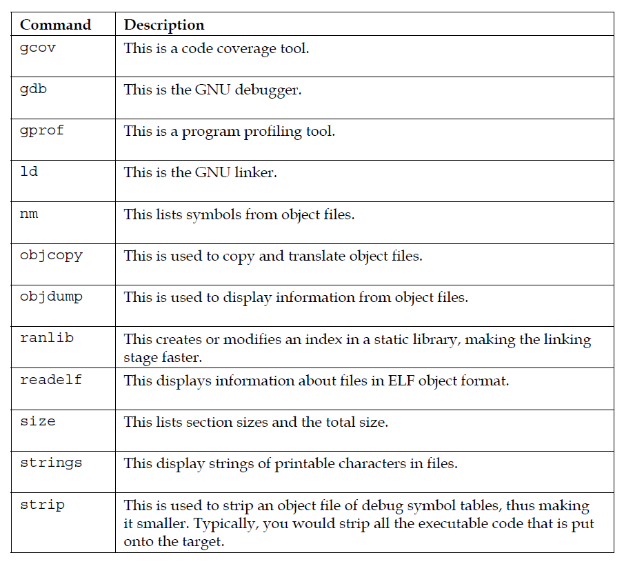
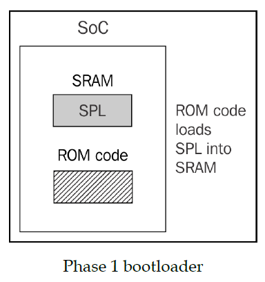

# Mastering Embedded Linux Programming

## Chapter 1 -> Starting Out
- Linux first became a viable choice for embedded devices around 1999. Today billions of devices running Linux.
- Here are some points that drive the adoption of Linux
    1. Linux has the necessary functionality. It has good scheduler, a good network stack, support for USB, Wifi, Bluetooth, and many kinds of storage media, good support for multimedia devices, and so on.
    2. Linux has been ported to a wide range of processor architectures, including some that are very commonly found in SoC designs - ARM, MIPS, x86, and PowerPC
    3. Linux is Open-Source, so you have the freedom to get the source code and modify it to meet your needs.You can remove features that you dont need to reduce memory and storage requirments. Linux is flexible.
    4. Linux has an active community. Kernel has every 10-12 weeks of release cycle.

- Project lifecyce :
    1. Board bring-up usually settings up enviroment and create a working platform
    2. Initialize the system
    3. Writing Embedded application
    4. Debugging and optimizing performance

- The four elements of embedded Linux
    1. **Toolchain** : This consist the compiler and other tools need to create code for your target device 
    2. **Bootloader** : This is necessary to initialize the board and to load and boot the Linux kernel
    3. **Kernel** : This is the heart of the system, managing system resources and interfacing with hardware
    4. **Root filesystem** : This contains the libraries and programs that are run once the kernel has completed its initialization.
- Basically open source licenses fall broadly into two categories
    1. **GPL(General Public License)** 
    2. **BSD(Berkeley Software Distribution)** : Dont modify license, do whatever you want.
- Most libraries are licensed under the **Lesser General Public License(LGPL)**. In this case, you are allowed to link with them from a proprietary program.
- Linux is just one component of open source software out of the many that you need to create a working product.

## Chapter 2 -> Learning About Toolchains
- The choices you make at this early stage will be profound impact on the file outcome.
- Toolchain should be
    1. Capable of making effective use of hardware
    2. Should support languages you require and have solid implementation of POSIX and other system interfaces
- Toolchain is the set of tools that compiles the source code in to executables. Which then can be run on target device.
- Toolchain used to compile other three elements of embedded Linux : Bootloader, kernel and root file system.
- GNU toolchain consist of three main components
    1. **Binutils** : A set of binary utilities including the assembler, the linker
    2. **GNU Compiler Collection(GCC)** : Compilers for C language and other languages.
    3. **C library** : A standardized API based on the POSIX specification which is the principle interface to the operating system kernel from applications

- Types of toolchain
    1. **Native** : Compiling on target system.
    2. **Cross** : Toolchain runs on different type of system than target system.
- Almost all of embedded linux is done using cross-development toolchain.
- Cross development means cross compiling all the libraries and tools that you need. Which is hard.

- The toolchain has to be built according to the capabilities of the target CPU which includes
    1. **CPU architecture** : ARM, MIPS, x86, ...
    2. **Big-Little Endian** : Some CPUs operate in both modes but machine code is different
    3. **Floating Point Support** : Not all embedded processors implement hardware floating point unit.
    4. **Application Binary Interface(ABI)** : The calling convention used for passing parameters between function calls
- The programming interface to the Unix operating system is defined in the C language. Even if you are writing programs in another language, the libraries will evetually call the C library.
- There are several C libraries
    1. **glibc** : Stardart GNU C library, its big but most complete implementation of the POSIX API
    2. **eglibc** : This is embedded GLIBC. no longer maintained
    3. **uClibc** : This is the micro controller C library.
    4. **musl libc** : It is new C library designed for embedded systems.

- With **crosstool-ng** we can create cross compiler automatically.
- The toolchain sysroot is a directory which contains subdirectories for libraries, header files, and other configuration files
- In sysroot
    1. **lib** : Contains shared objects for C library and dynamic linker/loader
    2. **usr/lib** : The static library achives for the C Library and other libraries that may be installed
    3. **usr/include** : Contains the headers for all the libraries
    4. **usr/bin** : Contains the utility programs that run on the target, such as the ldd command
    5. **usr/share** : Used for localization and internationalization
    6. **sbin** : Provides the ldconfig utility, used to optimize library loading paths

### Tools in Toolchain



- Components of the C library
    1. **libc** : The main C library, that contains the well-known POSIX functions such as printf, open, close, ...
    2. **libm** : Math functions such as cos, exp, ...
    3. **libpthread** : All the POSIX thread functions with names beginning with pthread_
    4. **librt** : The real-time extensions to POSIX, including shared memory and asynchronous I/O
- libc always linked but others must be explicitly linked with -l option
- Library code can be linked in two different ways
    1. **Statically** : Meanning that all the library functions your application calls and their dependencies, bounded into your executable
    2. **Dynamically** : Meaning that references to library files and functions are those in files are generated in the code but actually linking in done in run-time

- Creating static library is as simple as creating an achive of object files using the **ar**.
- Shared objects are linked at runtime, which makes more efficent use of storage and system memory
- One of the benefits of shared libraries is that they can be updated independently of the programs that use them.Library updates can be in below
    1. **Bug fixes-add new feature** : Backward-compatible way
    2. **Those break backward compatible way**
- Libraries so name is (shared object name) is follow some syntax below. <libraryname>.so.<interface number>. For example libjpeg.so.8, which point to via symbolic link to libjpeg.so.8.x.x
- libjpeg.so.8 : This is symbolic link used when loading the library at runtime. Points to actual shared library
- libjpeg.so.8.0.2 : This is the actual shared library, used at both compile and run time.

### Makefiles
- To compile anything with given tool chain
``` C
$ make CROSS_COMPILE = arm-cortex_a8-linux-gnueabi-gcc
// or set it as shell variable
$ export CROSS_COMPILE = arm-cortex_a8-linux-gnueabi-gcc
$ make
```

### Autotools
- Refers to a group of tools that are used as the build system in many open source projects
    1. GNU Autoconf
    2. GNU Automake
    3. GNU Libtool
    4. Gnulib
- The role of Autotools is to smooth over the differences between the many different types of systems.
- Packages that use Autotools come with a script named <code>configure</code> that checks dependencies and generatess makefiles according to what it finds
- Autotools is able to handle cross development as well.You can influence the behavior of the configure script by setting these shell variables
    1. **CC** : The C compiler command
    2. **CFLAGS** : Additional C compiler flags
    3. **LDFLAGS** : Additional linker flags
    4. **LIBS** : Contains a list of additional libraries to pass to the linker
    5. **CPPFLAGS** : Contains C/C++ preprocessor flags
    6. **CPP** : The C preprocessor to use
- Sometimes its sufficent to do below
``` C
$ CC=arm-cortex_a8-linux-gnueabihf-gcc ./configure
```
- <code>configure</code> tries to build code snippets and run them, to see what happens. In case of cross compiling, they wont work and it may generates errors
- Autotools understands three different types of machine that my be involved when compiling packages
    1. **Build** : This is the computer that is to build the package. Default to current machine
    2. **Host** : This is the computer that program will run on.
    3. **Target** : This is the computer the program will generate code for. For examle : It is used when building cross compiler
- So to cross compile 
``` C
CC=arm-cortex_a8-linux-gnueabihf-gcc ./configure --host=arm-cortex_a8-linux-gnueabihf
```
- Tracking package dependencies is quite complex. The package configuration utility, <code>pkg-config</code> helps track which packages are installed and which compile flags each needs.
- Toolchain is always starting point. Everything that follows from that is dependent on having a working, reliable toolchain

## Chapter 3 -> All About Bootloaders
- Bootloader starts the system up and loads the operating system kernel. It passes control from itself to the kernel using a data structure called a device tree, also known as **flattened device tree** or **FDT** 

### What does a bootlaoder do?
- Bootloader has 2 main jobs : Basic system initialization and loading the kernel.  Typically, the only resources operational at beginning are a single CPU core and some on-chip static memory.
- System bootstrap consists of several phases of code, each bringing more of the system into operation.
- The final act of the bootloader is load kernel image to RAM and create execution enviroment for it.
- Reset vector address of processor can be placed anywhere so it can put bootloader in any given non-volatile storage medium.
- Boot sequence is multi-stage prodecure

### Phase 1 : ROM Code
- In absence of reliable external memory, the code runs after reset or power on has to be stored on chip in SOC. This known as ROM code. It is programmed into chip when manufactured. It is proprietary and cannot be replaced by an open source equivalent



- The ROM code is capable of loading a small chunk of code from one of several preprogrammed locations into the SRAM.
- In SOCs where the SRAM is not large enough to load a full bootloader like U-Boot, there has to be an intermediate loader called the secondary program loader or **SPL**

### Phase 2 : SPL(Secondary Program Loader)
- The SPL must set up memory controller and other essential parts of the system to prepare the system to **third stage program loader(TPL)** into main memory


- The SPL may be open source, as is the case with the TI x-loader. But it is quite common for it to contain proprietary code that is supplied by the manufacturer as binary blob.

### Phase 3 -> TPL(Third Stage Program Loader)
- At the end of the third phase, there is a kernel in memory waiting to be started. 
- Embedded bootloaders usually disappear from memory once the kernel is running and perform no further part in the operation of the system.


- Some embedded designs have firmware based on the **Universal Extensible Firmware Interface(UEFI)** standart. The boot sequence is fundamentally the same.
- GRUB 2 is **GNU Grand Unified Bootloader version 2**. most commonly used Linux loader on PC platforms

### Moving from bootloader to kernel
- When the bootloader passes control to kernel it has to pass some basic information to the kernel, which may include some of following
    1. On PowerPC and ARM architectures : A unique number to type of the SoC
    2. Basic details of hardware detected so far : Location and size of physical RAM and CPU Clock
    3. The kernel command-line
    4. Optionally Location and size of device tree, and Ram disk

- The amount of information passed was very limited, leaving the bulk of it to be discovered at runtime or hard-coded into the kernel as "platform data". But this changed with Linux 3.8 at 2013

### Introducing Device Trees
- A device tree is a flexible way to define the hardware components of a computer system. Usually loader by bootloader and passed to kernel.
- The format is derived from a Sun Microsystems bootloader known as OpenBoot.
- The Linux kernel contains large number of device tree source files in arch/$ARCH/boot/dts.
- If you acquired your hardware from a third party, the dts file forms part of a board support package.
- The device tree represents a computer system as a collection of components joined together in a hierarchy, like a tree. The device tree begins with root node, represented by a forward slash. which contains subsequent nodes representing the hardware of the system.
- Each node has a name and contains a number of properties in form of name = "value". Basically its semi colon separated values.
- It is common convention that the names of nodes include an @ fllowed by an address that distinguishes them from any others.

#### reg property
- The memory and CPU have **reg** property, Which refers to a range of units in a register space. A reg consist of two values representing the start address and the size of range.
- Understanding reg properties becomes more complex when the address or size values cannot be represented in 32 bits. In 64-bit addressing, you need two cells for each.
- The structure of the device tree described so far assumes that there is a single hierarchy of components, whereas in fact there are several. As well as the obvious data connection between a component and other parts of the system, it might also be connected to an interrupt controller, to a clock source and to a voltage regulator. To express these connections, we have phandles.
- A lot of hardware is common between SoCs of the same family and between boards using same SoC. This is reflected in the device tree by splitting out common sections into **include** files, usually with the extension **.dtsi**
- The bootloader and kernel require a binary representation of the device tree, so it has to be compiled using the device tree compiler, dtc. The result file is ending wit **.dtb**, which is referred as a device tree binary or a device tree blob.
- There is copy of **dtc** in the Linux source, in scripts /dtc/dtc, and it is also available as a package on many Linux distribution.
``` C
// Simple compiling on files without #include
$ dtc simpledts-1.dts -o simpledts-1.dtb
```

### Choosing Bootloader
- Bootloader should be simple and customizable with lots of sample configurations for development boards and devices


#### U-Boot
- Maintained by Denx Software Engineering. More info can be found on www.denx.de/wiki/U-Boot

#### Building U-Boot
- Once u-boot is builded and flashed to sd card we can into u-boot command-line. It has quite simple terminal. U-boot doesnt have a filesystem.
- To automate the process, U-boot stores a sequence of commands in environment variables. If the special variable named **bootcmd** contains a script, it is run at power-up after a delay of **bootdelay** seconds.
- U-boot adopted the same configuration mechanism as the Linux kernel, **kconfig**

#### Kconfig and U-Boot
- The way **Kconfig** extracts configuration information from **Kconfig** files and stores the total system configuration in a file named .config.
- U-boot build can produce up to three binaries : a normal u-boot.bin, a Secondary Program Loader(SPL), and Tertiary Program Loader(TPL), each with possibly different configuration options.
- Consequently, lines in .config and default configuration files can be prefixed with the codes shown in the following :


##### Board-specific files
- Each board has subdirectory named board/[board_name] or board/[vendor]/[board_name] which should contain
    1. **Kconfig** : Contains configuration options for the board
    2. **MAINTAINERS** : Contains a record of whether the board is currently maintained and if so by whom
    3. **Makefile** : Used to build the board-specific code
    4. **README** : Contains any usefull information about this port of U-Boot for example, which hardware variants are covered

### BareBox
- Derived from U-boot and was actually called U-boot v2 in early days.

### Summary
- Every systems needs a bootloader to bring the hardware to life and to load a kernel.
- The device tree is simply a textual representation of a system that is compiled into a **device tree binary(dtb)** and which is passed to the kernel when it loads.

## Chapter 4 -> Porting and Configuring the Kernel
