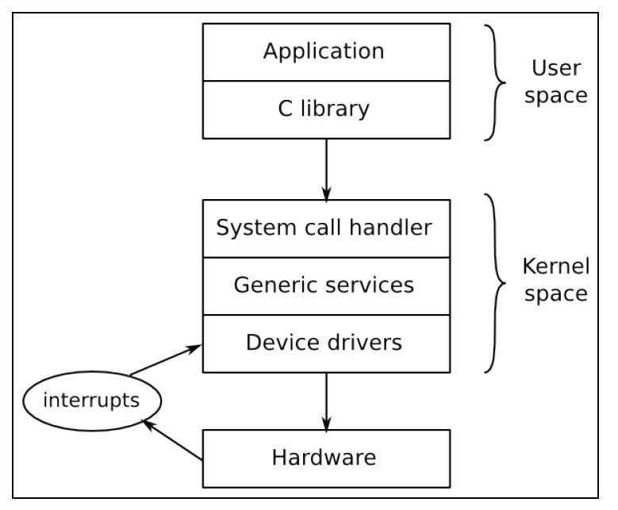
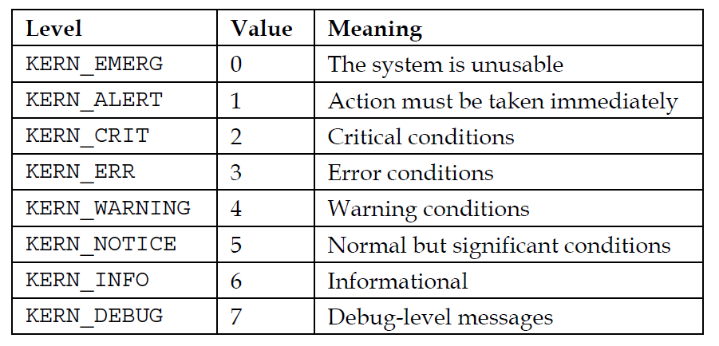
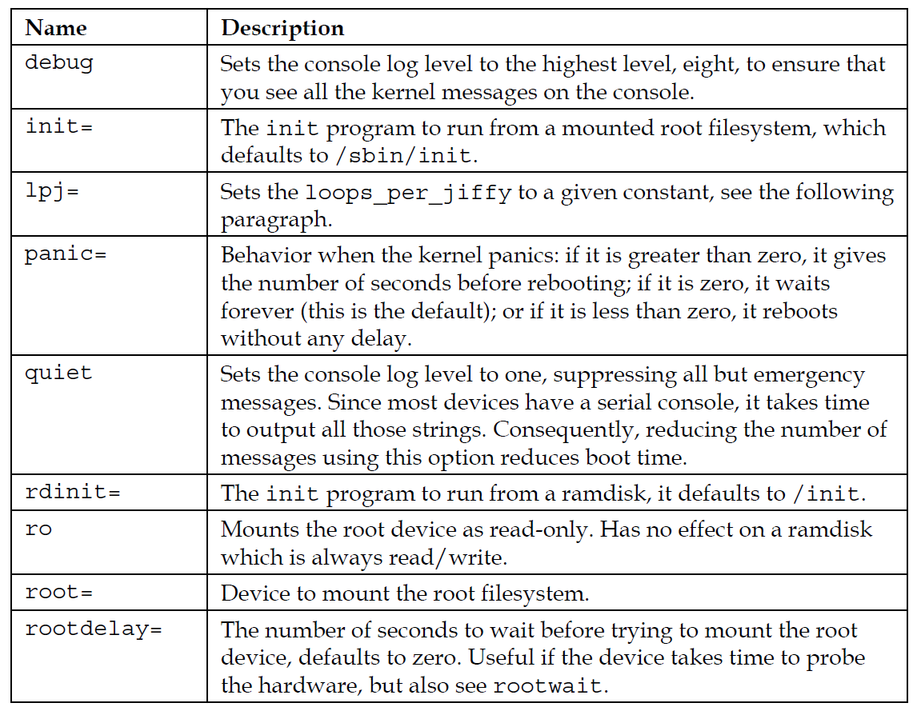
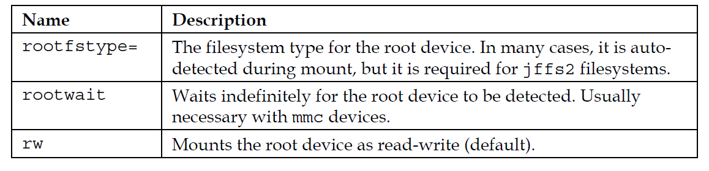
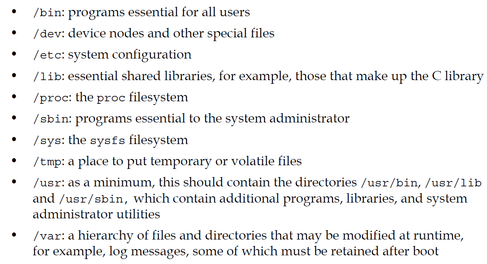
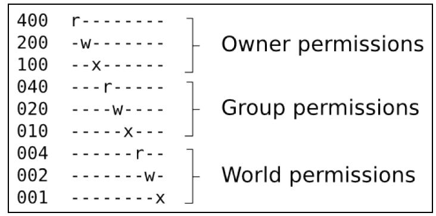
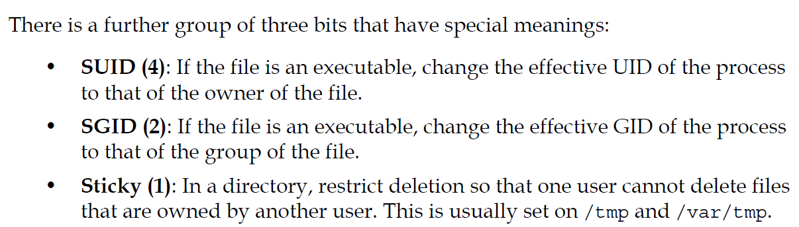

## Chapter 4 -> Porting and Configuring the Kernel
- The kernel is the third element of embedded Linux
- It is responsible for managing resources and interfacing with hardware and so affects almost every aspects of your final software build.
- Device tree allows you to create a generic kernel that is tailored to particular hardware.
- Linux is the only kernel. It combined with userspace components to make fully operating system.
- The kernel has three main jobs : 
    1. Manage resources
    2. Interface with hardware
    3. Provide an API that offers a usefull level of abstraction to user space programs.



- Applications running in user space run at low CPU **privilege level**. The primary interface between userspace and kernel space is C library, Which translates user level functions such as those defined by POSIX into kernel system calls.
- The system call interface uses an architecture-specific method such as a trap or software interrupt to switch CPU from the low privilege user mode to high privilege kernel mode. Which access to all memory addresses and CPU registers.
- Interrupts can only be handled in a device driver, never by a user-space application.
- All the useful things that application does, it does them through kernel.

### Kernel Development Cycle
- Linux developed at fast pace, every version is released 8 to 12 weeks cycles.
- The rapid rate of change of Linux is good thing but it does not fit very well with the longer life cycle of embedded projects.
- So kernel versions are maintained for longer periods and they are called **long term**

### Understanding Kernel Directory Structure
- **arch** : This contains architecture-specific files
- **Documentation** : Contains kernel documentation. Always look here first
- **drivers** : This contains device drivers, thousands of them.
- **fs** : This contains filesystem code.
- **include** : Contains kernel header files, including those rquired when building the toolchain.
- **init** : Contains the kernel start-up code
- **kernel** : Contains core functions, including scheduling, locking, timers, power management, and debug/trace code
- **mm** : Contains memory management
- **net** : Contains network protocols
- **scripts** : Contains useful scripts including device tree compiler, dtc, etc...
- **tools** : Contains many useful tools, Including Linux performance counters tool, perf, etc..

### Understanding Kernel configuration
- You can configure kernel to suit different jobs, from a small dedicated devices to complex devices.
- The configuration mechanism is called **Kconfig**, the build system that it integrates with is called **Kbuild**
- The configuration options are declared in a hierarchy of files named **Kconfig** using syntax described in Documentation/kbuild/kconfig-language.txt.
- You must specify an architecture when configuring Linux by setting ARCH = [architecture].
- The configuration items is stored in file named **.config** The variable names stored in .config are prefixed with CONFIG_
- There are several data types.
    1. **bool** : This is either y or not defined
    2. **tristate** : This is used where a feature can be built as a kernel module or built into main kernel image. The values are **m** for a module, **y** to be built in, and not defined if the feature is not enabled.
    3. **int** : This is an integer value written using decimal notation
    4. **hex** : This is an unsigned integer value written using hexdecimal notation
    5. **string** : This is a string value
- There may be dependencies between items, expressed by the **depends on** phrase.
- There are also reverse dependencies : The **select** keyword enables other options if this one is enabled.
- There are several configuration utilities that can read the Kconfig files and produce a .config file. Some of them display te menus on screen and allow you to make choices interactively. **Menuconfig** is probably most popular one.
- With some many things to configure, it is reasonable to start with a clean sheet each time you want to build kernel. There are set of known working configuration files in arch/$ARCH/configs, eachh containing suitable configuration values for a single SoC or a group of SoCs
- To bring old version .config file up to date, 
``` C
make ARCH = arm oldconfig 
```
- When you start the kernel build, a header file, include/generated/autoconf.h is generated, which contains a #define for each configuration value so that it can be included in the kernel source
- Locally we can append some extra info to kernel version to keep track it localy. This is done by setting CONFIG_LOCALVERSION which you will find in General setup configuration menu.

### Kernel Modules
- Desktop Linux distros use kernel modules extensively. Correct device and kernel functions can be loaded at runtime depending on the hardware detected and features required.
- Without them, every single driver and feature would be have to be statically linked into the kernel.
- With embedded devices, the hardware and kernel configuration is usually known at the time the kernel is  built so modules are not useful.
- It is quite common for embedded kernels to be built without any modules at all.
### Compiling
- The kernel build system, **kbuild** is set of make scripts that take the configuration information from the .config files, workout depedencies and compile everything that is necessary to produce kernel image containing all the statically linked components, possibly device tree binary and one or more kernel modules.

#### Compiling The kernel image
- To build kernel image, you need to know what your bootloader expects.
    1. **U-boot** : Traditionally U-boot has required a uImage, but newer versions can load a zImage file using the bootz command
    2. **x86 targets** : It requires a bzImage file
    3. **Most other bootloaders** : It requires a zImage file
- Example of building zImage file
``` C
$ make -j 4 ARCH=arm CROSS_COMPILE=arm-cortex_a8-linux-gnueabihf-zImage
``` 
- The -j 4 options tells make how many jobs to run in paralel, which reduces the time taken to build.
- Multi-platform support for ARM was introduced in Linux 3.7. It allows a single kernel binary to run on multiple platforms and is a step on the road toward havin small number of kernels for all ARM devices
- A kernel build generates two files in the top level directory. **vmlinux** and **system.map**. The first is kernel as an ELF binary. System.map contains the symbol table in human readable form.
- Most bootloaders cannot handle ELF code directly. There is a further stage of processing which takes vmlinux and places those binaries in arch/$ARCH/boot that are suitable for various bootloaders
    1. **Image** : vmlinux converted to raw binary
    2. **zImage** : For the PowerPC architecture, this is just a compressed version of Image, which implies that the bootloader must do the decompression
    3. **uImage** : zImage plus a 64-byte U-Boot header

#### Compiling Device trees
- The dtbs target builds device trees according to the rules in arch/$ARCH/boot/dts/Makefile using the device tree source files in that directory
- The .dtb files are generated in the same directory as the sources.

#### Compiling modules
- If you have configured some features to be built as modules, you can build them separately using the modules target.
- The compiled modules have a .ko suffix and are generated in the same directory as the source code meaning they are scattered all around the kernel source tree.

#### Cleaning kernel sources
- There are three make targets for cleaning the kernel source tree: 
    1. **clean** : removes object files and most intermediates
    2. **mrproper** : removes all intermediate files including the .config file.
    3. **distclean** : This is the same as mrproper but also deletes editor backup files, patch leftover files and other artifacts of software developments

### Kernel panic
- A panic occurs when the kernel encounters an unrecovable error. By default, it will print out a message on console and then halt.

### Early user space
- In order to transition from kernel initialization to user space, the kernel has to mount a root filesystem and execute a program in that root file-system.

### Kernel Messages
- Kernel developers are fond to printing out useful information through printk(); There are messages categorized : 


### Kernel command-line
- Kernel command-line is a string that is passed to the kernel by the bootloader via **bootargs** variable in case of U-boot.




- Complete list is at Documentation/kernel-parameters.txt

### Porting Linux to a new board
- The organization of architecture-specific code in arch/$ARCH differs from one system to another.

#### With device tree
- The first thing to do is create a device tree for the board and modify it to describe the additional or changed hardware on the board.
``` C
$ make ARCH=arm nova.dtb
```

#### Without device tree
- We need to create configuration name for the board.
- We need to add this to the Kconfig file of the mach- directory for your SOC and we need to add a dependency for the SoC support itself.
- There is source file named <code>board-*.c</code> for each board, which contains code and configuration which are specific to the target.

#### Summary
- Linux is very powerful and complex operating system kernel can be married to various user space.
- One of its strengths is the degree of configurability. 
- The customization of the kernel for particular target may consist of changes to the core kernel code, additional drivers for devices that are not in mainline Linux, a default kernel configuration file and device tree source file.
- If your hardware is based on well-known reference design then it may be just a question of making changes to the device tree or to the platform data.
- The kernel is the core of a Linux based system, but it cannot work by itself. It requires a root filesystem that contains user space.
- The root filesystem can be a ramdisk or a filesystem accesed via block device.

## Chapter 5 -> Building a Root FileSystem
- The techniques described here are broadly known as **roll your own** or **RYO**. But it rarely the case you need to create root filesystem by yourself. Usually build tools like **Buildroot** or **Yocto Project** handles it for us.
- The first objective is to create a minimal root filesystem that will give us a shell prompt. Then using that as a base, we will add scripts to start up other programs and configure a network interface and user permission.
- The kernel will get a root filesystem, either as a ramdisk, passed as a pointer from the bootloader or by mounting block device given on the kernel command line by **root=parameter**
- Once it has a root filesystem, the kernel will execute the first program by default named **init**
- It is up to the **init** program to begin processing scripts, start other programs and so on.
- You need these components as a minimum
    1. **init** : The program that starts everything off, usually by running a series of scripts
    2. **shell** : Needed to give you command prompt but more importantly run the shell scripts caleld by **init** and other programs
    3. **daemons** : Various seerver programs, started by **init**
    4. **libraries** : Usually the programs mentioned so far are linked with shared libraries which must be present in the root filesystem
    5. **Configuration files** : The configuration for **init** and other daemons is stored in a series of ASCII text files, usually in the /etc directory
    6. **Device nodes** : The special files that give access to various device drivers
    7. **/proc and /sys** : Two pseudo filesystems that represent kernel data structures as a hierarchy of directories and files. Many programs and library functions read these files
    8. **Kernel modules** : If you have configuration some parts of your kernel to be modules, they will be here, usually in /lib/modules/[kernel version].
- Linux does not care about the layout of files and directories beyond the existence of the program named by **init=** or **rdinit=**. However many programs expect certain files to be in certain places.
- The basic layout of a Linux system is defined in the **Filesystem Hierarchy Standart(FHS)**
- The significance of /usr is that it may be in a separate partition from the root filesystem so it cannot contain that is needed to boot the system up.



- Information about users, including the mapping froma UID to a name is kept in /etc/passwd
- Root user is always with UID of 0, and root group with GID 0.
- Security in Linux-based systems is mainly about restricting access to the root account





- The SUID bit is probably the most often used. It gives non-root users a temporary privilege escalation to super-user to perform a task.

### Programs for the root filesystem

#### The init program
- **init** is the first program to be run and so has PID 1.

#### Shell
- We need shell to run scripts and give us command-line prompt.
- some shells common in embedded systems
    1. **bash** : Is the big beast that we all know from Linux desktop
    2. **ash** : Also based on the Bourne shell. It is much smaller than bash and hence is very popular choice for embedded systems
    3. **hush** : Is very small shell. It is useful on devices with very little memory.

#### Utilities
- The shell is just a way of launching other programs and shell script is little more than a list of programs to run with some flow control.
- To make a shell usefull, you need the utility prgorams.

#### BusyBox to rescue
- Busy box combine all the tools together into a single binary.
- Busybox has over three hundred applets including an **init** program, several shells of varying levels of complexity, and utilities for most admin tasks.
- Busybox uses same Kconfig and Kbuild system of the kernel.

### Libraries for the root filesystem
- Programs are linked with libraries. You could link them all statically in which case would be no libraries on target device. But that takes unnecessarily large amount of storage
- So you need to copy shared libraries from the toolchain to the staging directory
- Usually when files are compiled with debug switch on. When we are compiling for target, we dont need debug switch. So we can save space without debug symbols contained in binary.

### Device Nodes
- Most devices in Linux are represented by device nodes, in accordance with Unix philosophy that **everything is a file**(except network interfaces)
- A device node may refer to block device or character device. Block devices are mass storage devices. A character device is pretty much anything else.
- Device nodes are created with syntax below
``` C
mknod <name> <type> <major> <minor>
// name : is the name of the device node you want to create
// type : is c for character devices, b for block
// major and minor are numbers used by kernel to route file requests
```
- You will need to create device nodes for all the devices you want to access on your system. You can do that manually like above or use device managers to create them automatically.
- You need just two nodes to boot with BusyBox: **console** and **null**

### The proc and sysfs filesystems
- proc and sysfs are pseudo filesystems gives info about kernel.
- Proc and sysfs privode another way to interact with device drivers.

### Mounting filesystems
- The mount command allows us to attach one filesystem to a directory within another, forming a hierarchy of filesystem
- The one at the top, which was mounted by the kernel when it booted, it called root filesystem

### Kernel Modules
- If you have kernel modules, they need to be installed into the root filesystem, using the kernel <code>make modules_install</code> target. 
- Be aware, that you have just created a dependency between the kernel and the root filesystem. If you update one, you have to update the other.

### Transfering the root filesystem to the target
- Transfering root filesystem to the target
    1. **ramdisk** : A filesystem image that is loaded into RAM by bootloader. Ramdisks are easy to create and have no dependencies on mass storage devices.
    2. **disk image** : A copy of root file system formatted and ready to be loaded onto a mass storage device on the target.
    3. **network filesystem** : THe staging directory can be exported to the network via an NFS server and mounted by the target at boot-time.

#### Creating a boot ramdisk
- A linux boot ramdisk, strictly speaking, an **initial RAM filesystem** or **initramfs** is compressed **cpio** archive. cpio is an old UNIX archive format, requires less code in kernel.
- You need to configure your kernel with CONFIG_BLK_DEV_INITRD to support **initramfs**
- There are three different ways to create a boot ramdisk
    1. As a standalone cpio archive -> most flexible
    2. As a cpio archive embedded in kernel image
    3. As a device table which kernel build system process as part of the build

#### The old initrd format
- There is an older format for a Linux ramdisk, known as **initrd**

### The init program
- Unix systems run a program called **init** that starts up and monitors other programs
- **init** begins by reading the configuration file, /etc/inittab.

### Configuring user accounts
- It is not good practice to run all programs as root.
- It is preferable to create unprivileged user accounts and use them where full root is not necessary.
- Usernames are configured in /etc/passwd. There is one line per use, with seven fields of information separated by colons
- Various programs have to read /etc/passwd so as to be able to loop up UID and names. so it has to be word-readable.
- But since passwords need to kept with hashes, they kept under /etc/shadow
- The group names are stored in similiar way in /etc/group

### Starting a daemon process
- Typically you would want to run certain background process at startup

### Better way of managing device nodes
- Creating device nodes statically with mknod is quite hard work and inflexible. There are other ways to create nodes automatically
    1. **devtmpfs** : This is pseudo filesystem that you mount over /dev at boot time. The kernel populates it with device nodes for new device as they are detected at runtime.
    2. **mdev** : This is a BusyBox applet is used to populate directory with device nodes and create new nodes. There is configuration file, /etc/mdev.conf which contains rules for ownership and the mode of the nodes
    3. **udev** : This is part of **systemd** and is the solution you will find on desktop linux and some embedded devices

- Allthough both **mdev** and **udev** create the device nodes themselves, it is more usual to let **devtmpfs** do that job and use mdev/udev as a layer on top to implement the policy for setting ownership and permission