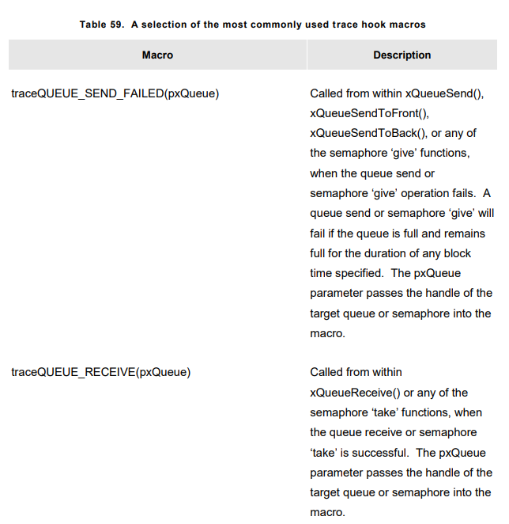

# **DEVELOPER SUPPORT**
- In C, the macro <code>assert()</code> used to verify an assertion(an assumption) made by the program. If expression given in paranthesis fails(return 0) then assertion have failed.


## configASSERT()

- FreeRTOS use <code>configASSERT()</code> instead. which can be defined by application writer in FreeRTOSConfig.h

- A failed assertion must be treated as a fatal error.

- Using <code>configASSERT()</code> improves productivity by immediately trapping and identifying many of the most common sources of error. It is strongly advised to have <code>configASSERT</code> defined while developing or debugging a FreeRTOS application, But it increases codes size.

- If application writer doesn't provide implementation of <code>configASSERT()</code>, then default empty definition will be used and all the calls to it will be removed by C pre-processor.

- For example we can disable interrupt when assertion fails, so tick wont tick and execution will stop. Example given below :
``` C
#define configASSERT(x) if((x) == 0) {taskDISABLE_INTERRUPTS(); for(;;)}
```


## FreeRTOS + Trace
- FreeRTOS + Trace is run-time diagnostic and optimization tool provided by Percepio.

- Captures dynamic behavior information, then represent captured information in interconnected graphical views.

- It can be used side-by-side with a tranditional debugger and complements the debugger view with higher level based perspective.


## Debug Related Hook(Callback) Functions.
- **Malloc failed hook** : Defining malloc failed hook ensures the application developer is notified immediately if an attempt to create a **task**, **queue**, **semaphore**, or **event group** fails.

- **Stack overflow hook** : Defining stack overflow hook ensures the application developer is notified if the amount of stack used by a task **exceeds** the stack space allocated to the task.

## Viewing Run-Time and Task State Information
- Task run-time statistic provide information on the amount of processing time each task has received. A task's **run time** is the **total** time the task has been in the **RUNNING** state since the application **booted**
- Run-time statics are intended to be used as a profiling and debugging aid during the development phase of a project. The information they provide is only valid until the counter used as runtime statistic  clock overflows.
- Collecting run-time statistic will increase the task context switch time.
- To obtain binary run-time statistic information, call the <code>uxTaskGetSystemState()</code> API Function.
- To obtain run-time statistic information as a human readable ASCII table, call the <code>vTaskGetRunTimeStats()</code> helper function.

### The Run-Time Statistic Clock
- Run-time statistic need to measure fractions of a tick period. Therefore RTOS tick count couldnt be used as run-time statistic clock. Clock is provided by application code.
- It is recommended to make frequency of run-time statistic clock between **10** to **100** times **faster** than tick interrupt frequency. The faster is the clock the more accuarate statistic will be, but sooner the time value will **overflow**.
- Steps :
    1. Configure timer peripheral to generate periodic interrupt at desired run-time statistic clock frequency, then count number of interrupts generated as the run-time statistic clock. This method very inefficent if periodic interrupt is only used for the purpose of providing run-time statistic clock. 
    2. Generate 32-bit value by using the current value of a free running 16-bit peripheral timer as the 32 bit value's **least** significant bits and number of timer has over flowed as 32-bit **most** significant 16-bits

### Configuring an Application to Collect Run-Time Statistic
- There is macros necessary to collect task run-time statistic in FreeRTOSConfig.h


- **uxTaskGetSystemState()** API Function provides a snapshot of status information for each task under the control of the FreeRTOS scheduler. The information is provided as an array of TaskStatus_t structures, with one index in the array for each task. 
- Prototype :
``` C
UBaseType_t uxTaskGetSystemState(TaskStatus_t * const pxTasksStatusArray, const UBaseType_t uxArraySize, uint32_t * const pulTotalRunTime);
```


- <code>xTASK_STATUS</code> structure :
``` C
typedef struct xTASK_STATUS
{
    TaskHandle_t xHandle;
    const char *pcTaskName;
    UBaseType_t xTaskNumber;
    eTaskState eCurrentState;
    UBaseType_t uxCurrentPriority;
    UBaseType_t uxBasePriority;
    uint32_t ulRunTimeCounter;
    uint16_t usStackHighWaterMark;
}TaskStatus_t;
```


- **vTaskList()** Helper function provides similiar task status information that provided by <code>uxTaskGetSystemState()</code> but it presents the information as a human readable ASCII table rather than an array of binary values. It is very processor intensivee function and leaves scheduler suspended for extended period. It is recommended to used for **debug purposes only** and not in a production real-time system. It is available only if macros below defined in FreeRTOSConfig.h 
``` C
#define configUSE_TRACE_FACILITY 1
#define configUSE_STATS_FORMATTING_FUNCTIONS 1
```
- Prototype : 
``` C
void vTaskList(signed char *pcWriteBuffer);
```


- This function generates output as following
    1. Each row provides information on a single task
    2. The first column is the task name
    3. The second column is task state, **R** -> **READY**, **B** -> **BLOCKED**, **S** -> **SUSPENDED**, **D** -> **DELETED**. Deleted will be reported for short period of time, after that time task will not exist and it will be invalid to try to reach its handle.
    4. Third column is the task priority
    5. The fourth column is the stack high water mark.
    6. The fifth column is the unique number allocated to the task. 


- **vTaskGetRunTimeStats()** Helper Function **formats** collected run-time statistic into a human readable ASCII Table. It is very processor intensive function and leaves the scheduler suspended for extended period. Therefore recommended the function is used for debug purposes only, not in production real time system. It is available only when macros below defined in FreeRTOSConfig.h file.
``` C
#define configGENERATE_RUN_TIME_STATS 1
#define configUSE_STATS_FORMATTING_FUNCTIONS 1
```
- Prototype :
``` C
void vTaskGetRunTimeStats(signed char *pcWriteBuffer);
```


- Output generated in format as below
    1. Each row provides information on single task
    2. The first column is the task name
    3. The second column is the amount of time the task has spent in the **RUNNING** state as an **absolute** vlue.
    4. The Third column is the amount of time the task spent in **RUNNING** state as **percentage** of total time since the target was booted. Normally it should be less than %100 because statistic are collected and calculated using integer calculations round down to nearest integer value.


## Trace Hook Macros
- Trace macros are macros that have been placed at key points within FreeRTOS Source code. By default macros are empty and dont generate any code and have no run time overhead. By overriding empty implementation, we can 
    1. Insert code into FreeRTOS without modifying the FreeRTOS source files.
    2. Output detailed execution sequencing information by any means available on the target hardware.Trace macros are used to create **full** and **detailed** scheduler activity trace and profiling log.

- Many macros uses, <code>pxCurrentTCB</code>, which is private variable that holds the handle of task that is in **RUNNING** state, and it is available to any macro called from **tasks.c** 

- List of some available macros are listed below.





- Each macro has default **empty** definition. This can be override by providing same definition for macro in FreeRTOSConfig.h. If trace macro definitions become long or complex, then they can be implemented in new header file that is then itself included from FreeRTOSConfig.h

- In accordance with software engineering best practice, FreeRTOS maintains strict data hiding policy. Inside **tasks.c** task handle is pointer to data structure that describes a task(TCB, Task Control Block). But outside of tasks.c task handle is pointer void.


