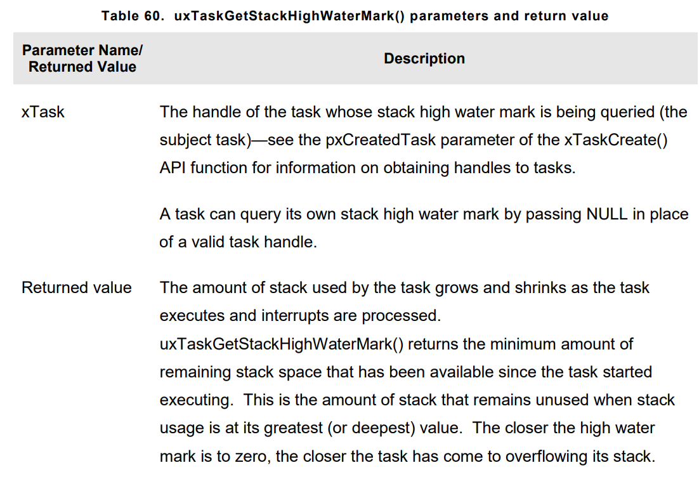

# **TROUBLE SHOOTING**
- Most common 3 issues with FreeRTOS , **incorrect interrupt priority assignment**, **stack overflow**, and **inappropriate use of printf()**

- Using <code>configASSERT()</code> improves productivity by immediately trapping and identifying many of most common sources of error. It is strongly advised to have <code>configASSERT()</code> while developing or debugging a FreeRTOS application.

## Interrupt Priorities
- This is the number one cause of support requests, and most port defining <code>configASSERT()</code> will trap the error immediately.

- If FreeRTOS port make use of interrupt nesting, and service routine for interrupt make use of FreeRTOS API, it is essential to set interrupt priority below <code>configMAX_SYSCALL_INTERRUPT_PRIORITY</code> . Failure to do this will result ineffective critical sections, which in turn will result in intermittent failures.

- Take particular care if running FreeFRTOS on processor where :
    1. Interrupt priorities default to having highest possible priority. Which is the case on some ARM Cortex processors and possible others. The priority of an interrupt uses that FreeRTOS API **cannot** be left **uninitialized**.
    2. Numerically high priority represnt logically low interrupt priorities, This is the case on ARM Cortex processors. Might be on others too
    3. Interrupt proiorities always has to be lower(numerically higher) than <code>configMAX_SYSCALL_INTERRUPT_PRIORITY</code>
    4. Different library implementation might be specified in different way.  
    5. Different implementation of same architecture might implement different number of interrupt priority bits. The bits that define the priority of an interrupt can be split between bits that **pre-emption** priority and bits that define a **sub-priority**.

## Stack Overflow
- Stack overflow is the second most common source of support requests. FreeRTOS provides several features to assist trapping and debugging stack related issues.

- **uxTaskGetStackHighWaterMark** API Function is used to get higher point of stack. Each task maintains its own stack, the total size of which is specified when the task is created. This function  query how close a task has come to overflowing the **stack** space allocated to it.
- Prototype :
``` C
UBaseType_t uxTaskGetStackHighWaterMark(TaskHandle_t xTask);
```



### Run Time Stack Checking
- FreeRTOS includes two optional run time stack checking mechanism. There are controller by <code>configCHECK_FOR_STACK_OVERFLOW</code> compile time configuration constant within FreeRTOSConfig.h Both methods **increase** the time it takes to perform a context switch.
- Stack overflow hook(stack overflow callback) is function that is called by kernel when it detects a stack overflow.
- To use stack overflow
    1. Define macro below.
    ``` C
    #define configCHECK_FOR_STACK_OVERFLOW 1 // could be defined as 2 aswell. 
    ```
    2. Provide implementation of the hook function as prototype below
    ``` C
    void vApplicationStackOverflowHook(TaskHandle_t *pxTask, signed char *pcTaskName);
    ```
- This hook provided to make trapping and debugging stack errors easier, but there is not real way to recover from a stack overflow.
- The stack overflow hook gets called from the context of an interrupt.


#### Run Time Stack Checking - Method 1
- Method 1 is selected when macro below is defined
``` C
#define configCHECK_FOR_STACK_OVERFLOW 1
```
- A task entire execution context ics saved onto its stack each time it gets swapped out. It is likely that will be time at which stack usage reaches its peak. When this method used, kernel checks that stack pointer remains within the valid stack space after context has been saved. Method 1 is quick but can miss stack overflows that occur between context switches.

#### Run Time Stack Checking - Method 2
- Method 2 performs additional checks to those already in method 1. To use it macro below must be defined
``` C
#define configCHECK_FOR_STACK_OVERFLOW 2
```
- When task created, its stack is filled with known pattern. Method 2 tests the last valid 20 bytes of task stack space to verify that pattern hasn't overwritten. The stack overflow hook function is called if any of the 20 bytes have changed from expected value.
- Method 2 is not **fast** as method 1, but still relatively fast. But still it is possible to miss some overflows.

## Inappropriate Use of printf() and sprintf()
- Many cross compilers will provide <code>printf()</code> implementation that is suitable for use in small embedded systems. Even when that is the case, the implementation may not be **thread-safe**, probably wont be suitable for use inside ISR, depending where the output is directed, take a relatively long time to execute.

- Just including <code>printf()</code> or <code>sprintf()</code> can massively increase the size of application executable.
- <code>printf()</code> and <code>sprintf()</code> may call <code>malloc()</code>, which might be invalid if memory allocation scheme other than <code>heap_3</code> is in use. 
- <code>printf()</code> and <code>sprintf()</code> mamy require stack that is many times bigger than would otherwise to be required.

- Many of FreeRTOS demo project use file called, **Printf.stdarg.c**, which provides a minimal, stack-efficent implementattion of **sprintf()** that can be used in place of standart library version.

## Other Common Sources of Error
- The idle task, and possible the RTOS deamon task, are created automatically when <code>vTaskStartScheduler</code> is called. <code>vTaskStartScheduler()</code> will return only if there is not enough heap memory remaining for these task to be created.
- Using FreeRTOS Api function(doesnt Contain FromISR in their name) might cause application crash.
- Making sure Interrupt Routine doesn't causse stack overflow.
- Some processors must be in **privileged** mode before the scheduler can be started. The easiest way to achive this is to place processor into **privileged** mode within C startup code, before <code>main()</code> is called
- If FreeRTOS API Functions called before <code>vTaskStartScheduler()</code>, interrupts deliberately be left disabled. This is done to protect system from crashes by interrupts attempting to use FreeRTOS API Function during initialization before scheduler started. 