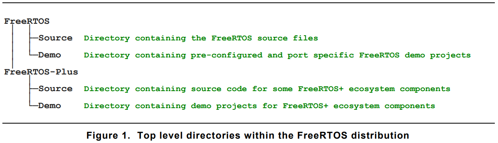
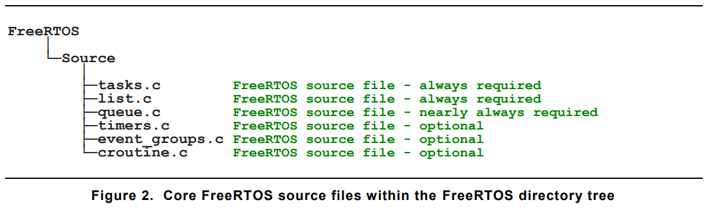
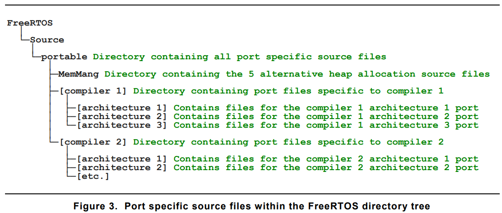
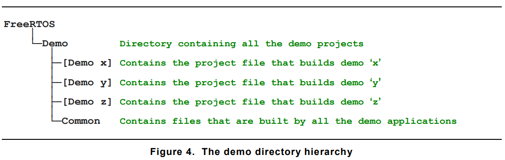
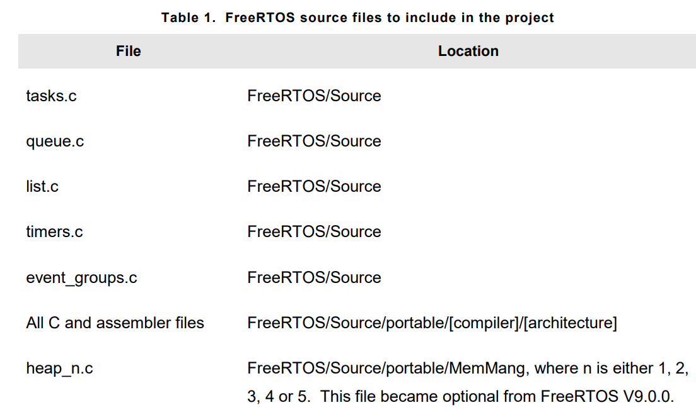
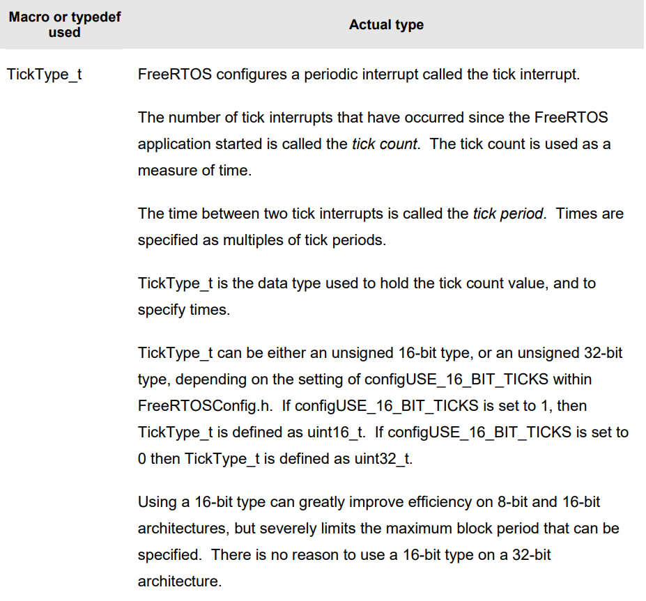
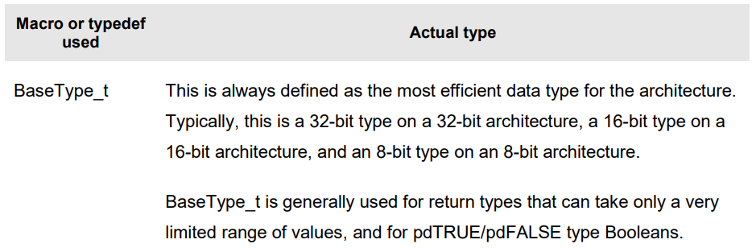
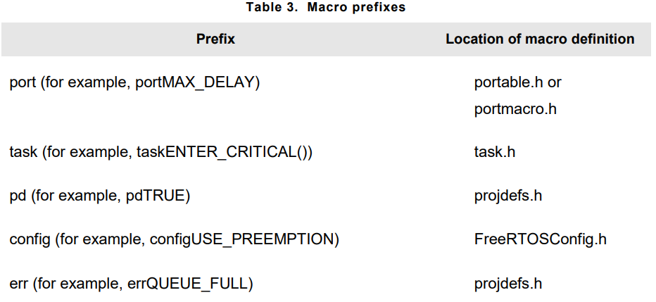
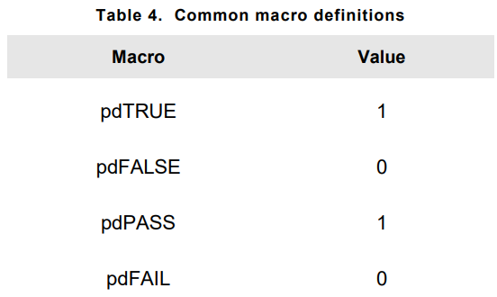

# THE FreeRTOS DISTRIBUTION

## Chapter Introduction and Scope
- FreeRTOS distributed as single **zip-file** and contains **all** offical FreeRTOS **ports** and large number of pre-confiured **demo** applications

### Understanding the FreeRTOS Distribution
- FreeRTOS can be built approx. with twenty different compilers, can run on more than thirty different processor architectures.

- FreeRTOS can be considered as library that provides **multi-tasking** capabilities

- **FreeRTOSConfig.h** : FreeRTOS configured by this header file. Contains application specific definitions, Also it should be located in directory of project, not with FreeRTOS source code. Every FreeRTOS project contains **FreeRTOSConfig.h** file. Not necessary to create one from stracth. Rather use exisiting one from demo project.

- FreeRTOS structure :




- The core FreeRTOS source code is contained in just two C files are that common to all the FreeRTOS ports
    1. **tasks.c**
    2. **list.c**

- In addition there could be another files
    1. **queue.c**          : provides both queue and semaphore services
    2. **timers.c**         : provides software timer functionality
    3. **event_groups.c**   : provides event group functionality
    4. **croutine.c**       : implements the Free-RTOS co-routine functionality. Intended for use on very small microcontrollers, rarely used now.



- Changing filenames are not recommended. If filenames are changed, it would break compatibility with the many thousands of projects that use FreeRTOS, as well as automation tools and IDE plug-ins.

- Source files specific to FreeRTOS port are contained within the <code>FreeRTOS/Source/portable</code> directory. This directory arranged as a hierarcy, first by compiler, then by processor architecture

- FreeRTOS source files, you must also build the files located in <code>FreeRTOS/Source/portable/[compiler]/[architecture]</code> directory.

- FreeRTOS also consider heap memory allocation to be part of the portable layer.  Heap memory manager required if macro below defined or left undefined in FreeRTOSConfig.h file.
``` C
#define configSUPPORT_DYNAMIC_ALLOCATION 1
```

- FreeRTOS provides five example heap allocation schemes. They are named **heap_1.c**, **heap_2.c**, **heap_3.c**, **heap_4.c**, **heap_5.c**. This files are under <code>FreeRTOS/Source/portable/MemMang/</code> directory. If you configured FreeRTOS to use dynamic memory allocation, it is necessary to build one of five source files in your project.



- Include paths : 
    1. The path to the core FreeRTOS header files, which is always <code>FreeRTOS/Source/include</code>
    2. Path to the source files that are specific to FreeRTOS port. <code>FreeRTOS/Source/portable/[compiler]/[architecutre]</code>
    3. A path to the <code>FreeRTOSConfig.h</code>

- Header files : A source file that uses FreeRTOS API must include macro below.
``` C
#include "FreeRTOS.h"
```

### Demo Applications
- Each FreeRTOS port comes with at least one demo application.

- FreeRTOS is developed and tested on Windows host. Testing on Linux sometimes might cause some errors.




### Creating a FreeRTOS Project
- **FreeRTOS/Source/include**
- **FreeRTOS/Source/portable/[compiler]/[architecture]
- FreeRTOSConfig.h file in program directory.



### Data Types and Coding Style Guide
- Each port of FreeRTOS has unique **portmach.h** Header file that contains definitions for tw port specific data-types <code>TickType_t</code> and <code>BaseType_t</code>





- When using **char**, it must explicitly decleared as **signed** or **unsigned**. 

- Plain int types are never used.

#### Variable names :
- Variables are prefixed with their type: 
    1. **c** for char
    2. **s** for int16_t(short)
    3. **l** for int32_t(long)
    4. **x** for BaseType_t and any other non-standart types(structures, task handles, queue handles...);
    5. **u** for unsigned
    6. **p** for pointer

#### Function Names :
- Functions are prefixed with both what they **return** and the file they are **defined** within. For example :
    1. v**Task**PrioritySet()   -> returns void, defined in **taskc.**
    2. x**Queue**Receive()      -> returns variable type **BaseType_t** and defined in **queue.c**
    3. pv**Timer**GetTimerID()  -> returns pointer to void and defined in **timers.c**

- File scope(private) functions are prefixed with **prv**

- Most macros are written in upper case, and prefixed with lower case letters that indicate where the macro is defined :



- Semaphore API is written almost entirely as a set of macros, but follows function naming convention.


