# HEAP MEMORY MANAGEMENT

## Introductin and Scope

- From FreeRTOS v9.0.0 FreeRTOS applications can be completely statically allocated, removing the need to include a heap memory manager.

- FreeRTOS provided as a set of C source files, so being competent C programmer is a prerequisite. 

- Kernel objects are dynamically allocated at run-time. This simplifies API, minimize RAM footprint, reduces design and planning effort.

- Standart library functions **malloc()** and **free()** can be used, but they may not be suitable, appropriate for following reasons
    1. They are not always available on small embedded systems.
    2. Their implementation can be relatively large, taking up valuable code space
    3. They are rarely thread-safe
    4. They are not deterministic, the amount of time taken to execute the function will differ from call to call
    5. They can suffer from fragmentation
    6. They can complicate the linker configuration
    7. They can be the source of difficult to debug errors if the heap space is allowed to grow into memory used by other variables.

- Early versions of FreeRTOS used a **memory pools allocation scheme**, whereby pools of different size memory blocks were **pre-allocated** at compile time, then returned by the memory allocation functions.But this **doesn't** use RAM **efficently**.

- Since embedded systems require different requirements, FreeRTOS provides 5 different heap management scheme. FreeRTOS uses :
    1. **pvPortMalloc()** instead of **malloc()**
    2. **vPortFree()** instead of **free()**

- pvPortMalloc and vPortFree can be called from application code. 

- **pvPortMalloc()** and **vPortFree()** comes in 5 different implementation
    1. **heap_1.c**
    2. **heap_2.c**
    3. **heap_3.c**
    4. **heap_4.c**
    5. **heap_5.c**

## Example Memory Allocation Schemes

### **heap_1.c**
- It is common for small dedicated embedded systems to only create tasks and other kernel objects before the scheduler has been started. Memory only gets dynamically allocated by the kernel **before** the application starts to perform any real-time functionality, and memory remains allocated for the **life-time** of application.

- heap_1.c implements very basic version of **pvPortMalloc()** and does **not** implement **vPortFree()**. Applications that never delete a task, or other kernel object, have potential to use heap_1.c

- Some commercially critical and safety critical systems would use heap_1.c

- Critical systems often prohibit dynamic memory allocation because of the uncertainties associated with nondeterminism, memory fragmentation, and failed allocations

- The heap_1.c allocation scheme subdivides a simple array into **smaller blocks**

- The total size(in bytes) of the array set by definition below in **FreeRTOSConfig.h**
``` C
#define configTOTAL_HEAP_SIZE (SIZE_IN_BYTES)
```

- Each created task requires a task control block(TCB) and stack to be allocated from the heap.

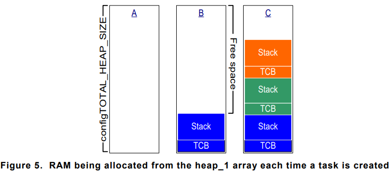

### **heap_2.c**

- **heap_2.c** retained in the FreeRTOS for backward compatibility, but doesn't recommended for new designs. Use **heap_4.c** instead of **heap_2.c**

- **heap_2.c** also works by subdividing an array that is dimensioned by macro below
``` C
#define config_TOTAL_HEAP_SIZE (SIZE_IN_BYTES)
```
- It uses **best fit** algorithm to allocate memory and **doesn't allow** memory to be freed. array statically declared, so It will consume alot of RAM, even before any memory from the array has been assigned.

- The best fit algorithm ensures that **pvPortMalloc** uses the free block memory that is closest in size to the number of bytes requested.

- Unlike **heap_4.c**, **heap_2.c** does not combine adjacent free blocks into a single larger block, so it is more susceptible to fragmentation

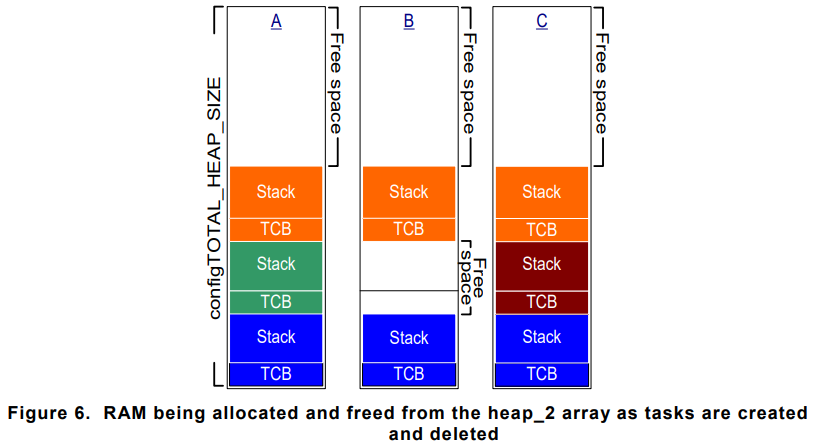

- **heap_2.c** is not **deterministic** but **faster** than most standart library implementation of **malloc()** and **free()**

### **heap_3.c**

- **heap_3.c** uses the **standart** library **malloc()** and **free()** functions, soze the size of the heap is defined by the linker configuration, and the macro below has no affect.
``` C
#define configTOTAL_HEAP_SIZE (SIZE_IN_BYTES)
```

- **heap_3.c** makes **malloc()** and **free()** thread-safe by temporarily suspending the FreeRTOS scheduler. 


### **heap_4.c**
- **heap_4.c** works by subdividing an array into smaller blocks. Array is **statically** allocated and dimensioned by macro below.
``` C
#define configTOTAL_HEAP_SIZE (SIZE_IN_BYTES)
```

- It will consume a lot of RAM, even before any memory has actually been allocated.

- **heap_4.c** uses first fit algorithm to allocate memory. Unline **heap_2.c**, combines adjacent free blocks of memory into **single** larger block, which **minimizes** risk of memory fragmentation.

- First fit algorithm ensures **pvPortMalloc()** uses the first free block of memory that is large enough to hold the numbers of bytes requested.

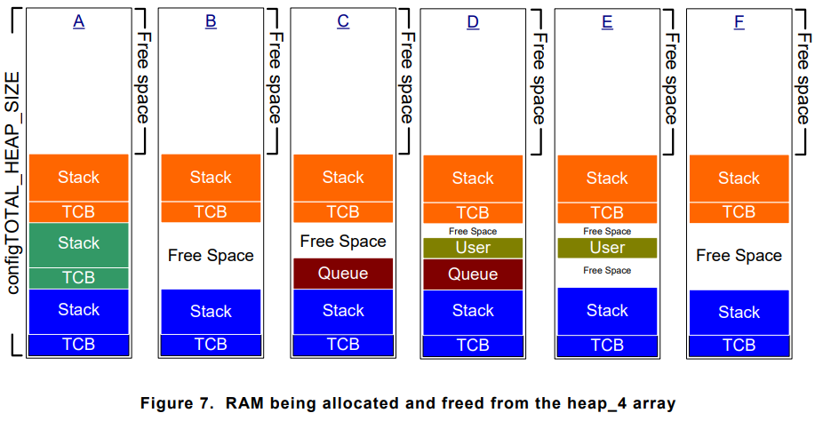

- **heap_4.c** is <code>not deterministic</code> but faster than most standart library implementation of **malloc()** and **free()**

- Sometimes it is necessary for application to place the array used by heap_4 at specific memory address. For example to ensure heap is located in fast internal memory, rather than slow external memory.

- Normaly start address is set by linker, However if we set macro below(in FreeRTOSConfig.h), then the array must be instead declared by the application.
``` C
#define configAPPLICATION_ALLOCATED_HEAP 1
```

- If so, then we have to declare this in our application source code.
``` C
uint8_t ucHeap[ configTOTAL_HEAP_SIZE ] __attribute__ ( ( section( ".my_heap" ) ) ); // GCC Compiler
```

``` C
uint8_t ucHeap[ configTOTAL_HEAP_SIZE ] @ 0x20000000; // specific address on IAR Compiler
```
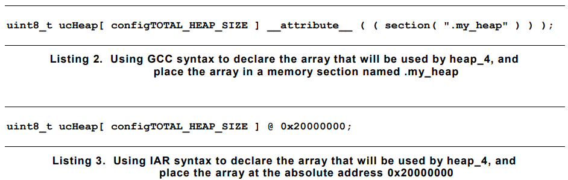

### **heap_5.c**
- The algorithm used by **heap_5.c** to allocate and free memory is identiacal to used by **heap_4.c**. Unlike **heap_4.c** is not limited to allocating memory from a single staticaly declared array, **heap_5** can allocate memory from multiple and separated memory spaces. It is usefull when the RAM provided by the system on which FreeRTOS is runing **does not** appear as a single contiguous block in the system memory map.

- heap_5.c provided memory allocation scheme that must be **explicitly** initialized before **pvPortMalloc()** can be called. **heap_5** is initialized using the <code>vPortDefineHeapRegions()</code> API function. When heap_5 is used <code>vPortDefineHeapRegions()</code> must be called before any kernel object can be created.

- <code>vPortDefineHeapRegions()</code> API Function
``` C
typedef struct HeapRegion
{
 /* The start address of a block of memory that will be part of the heap.*/
    uint8_t *pucStartAddress;
 /* The size of the block of memory in bytes. */
    size_t xSizeInBytes;
} HeapRegion_t;

void vPortDefineHeapRegions(const HeapRegion_t * const pxHeapRegions);
```
- Each separate memory areas is described by a structure of type <code>HeapRegion_t</code>. A description of all the available memory areas is passed into <code>vPortDefineHeapRegions()</code> as an array of <code>HeapRegions_t</code> structures.

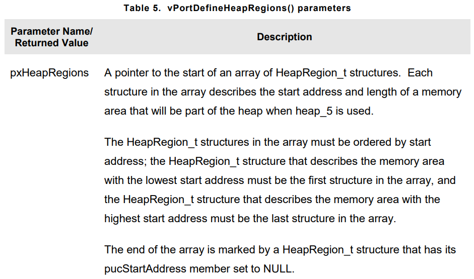


- Or in example below we can define 3 different heap region for heap_5.

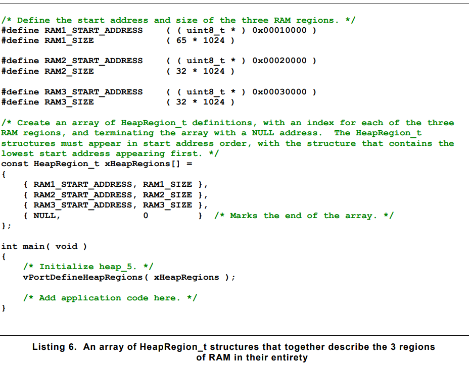

- To do this example on STM32F407 board; heap_5 is chosen as allocation method, CCRAM used for heap,

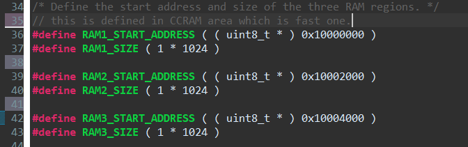

- Array of structures are defined.

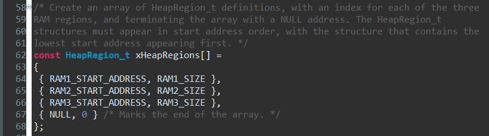

- Then heap region is defined, scheduler called.

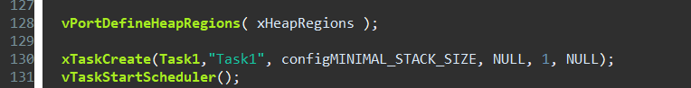

- When a project is built, the linking phase of the build process allocates a RAM address **to each variable**. The RAM available for use by the linker is normally described by a linker configuration file, such as **a linker script**. 

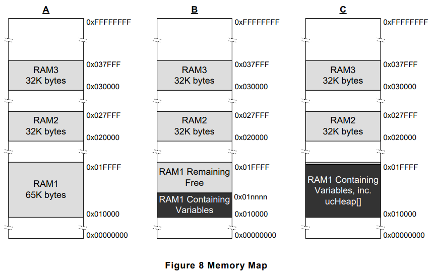

- In this picture, it is assumed the linker script included information on **RAM1**, but didn't include information on **RAM2** or **RAM3**. The linker has therefore placed variables in **RAM1**, leaving only the portion of **RAM1**, **above** adress **0x0001nnnn** available for use by heap_5.The actual value of 0x0001nnnn will depend on the combined size of all the variables included in the application being linked.
The linker has left all of RAM2 and all of RAM3 unused, leaving the **whole** of **RAM2** and the whole of **RAM3** available for use by heap_5.

- RAM allocated to heap_5 below address **0x0001nnnn** would overlap the RAM used to hold variables. To avoid that, the first
HeapRegion_t structure within the xHeapRegions[] array could use a start address of 0x0001nnnn, rather than a start address of 0x00010000. However, that is not a recommended solution because 
1. The start address might not be easy to determine
2. The amount of RAM used by the linker might change in future builds, necessitating an update to the start address used in the **HeapRegion_t** structure
3. The build tools will not know, and therefore cannot warn the application writer, if the **RAM** used by the **linker** and the RAM used by heap_5 overlap

- The picture below demonstrates a more convenient and maintainable example. It declares an array called **ucHeap**. **ucHeap** is a normal variable, so it becomes part of the data allocated to **RAM1** by the linker. The first **HeapRegion_t** structure in the **xHeapRegions** array describes at the start address and size of **ucHeap**, so **ucHeap** becomes part of the memory managed by heap_5. The size of ucHeap can be increased until the **RAM** used by the linker consumes all of RAM1.

- <code>xPortGetFreeHeapSize()</code> API Function : returns number of **free bytes** in the heap at time the function is called. It can be used to optimize the heap size. It is not available when heap_3 is used.
- Prototype : 
``` C
size_t xPortGetFreeHeapSize(void);
```
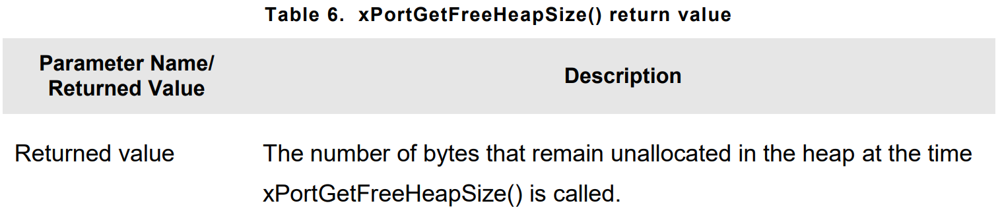


- <code>xPortGetMinimumEverFreeHeapSize</code> API Function : returns minimum number of unallocated bytes that have ever existed in the heap since FreeRTOS application started executing. This function only available when **heap_4** or **heap_5** used
- Prototype : 
``` C
size_t xPortGetMinimumEverFreeHeapSize(void);
```

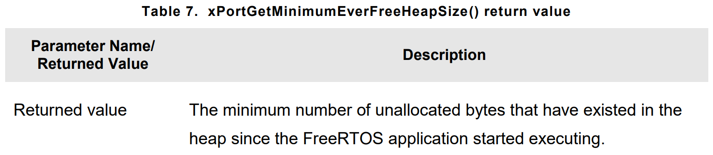

- If **pvPortMalloc()** function returns null(not enough to allocate memory), there is a mechanism could be configured to call hook function. In FreeRTOSConfig.h macro below should be configured.
``` C
#define configUSE_MALLOC_FAILED_HOOK    1
```
- Prototype : <code>void vApplicationMallocFailedHook(void);</code>