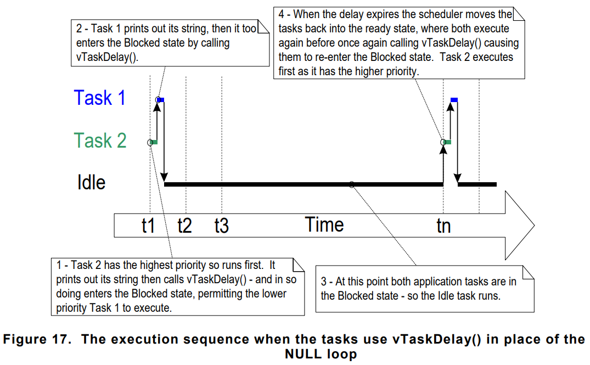
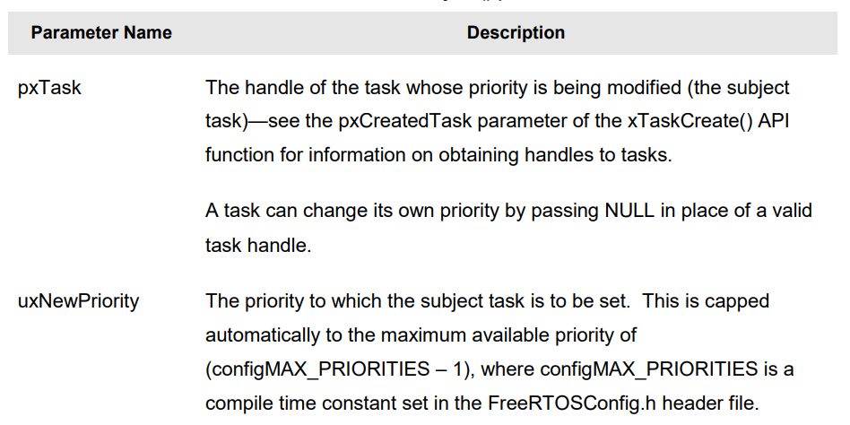

# **Task Management**

## Task Functions
- Tasks are implemented as C functions. They must void and take void pointer parameter.
- Prototype : 
``` C
void aTaskFunction(void *pvParameters)
```

- Each task is **small program** in its own right. It has entry point and will normally run **forever** in infinite loop. If task no longer required, it should be instead be explicitly **deleted**.

- A single task function can be used to create any number of task. Each task being a separate execution instance, with its own stack.

- If the processor running the application contains a **single core**, then only one task can be **executing** at any given time.

- Task can exist in one of **two states**, **Running** and **Not Running**

- When task is in **Running state** the processor is executing the task code. When is in the **Not Running** state, task is dormant, status having been saved ready for it to resume execution for next time scheduler decides it should enter **Running state**


- A task transitioned from **Not Running** state to **Running** state, it said **switched-in**. Scheduler is **only** entity that can switch a task in and out.

## Creating Task

- Tasks are created by using FreeRTOS <code>xTaskCreate()</code> API Function. 
- Prototype : 
``` C
BaseType_t xTaskCreate(TaskFunction_t pvTaskCode, const char * const pcName, uint16_t usStackDepth, void *pvParameters, UBaseType_t uxPriority, TaskHandle_t *pxCreatedTask);
```
- Parameters and return value :


- It is also possible to create task within other task. Also we can pass parameters to task with <code>void * </code>


## Task Priorities
- The <code>uxPriority</code> parameter of <code>xTaskCreate()</code> API Function assigns an initial priority to the task being created. The priority can be changed after the scheduler has been started by using <code>vTaskPrioritySet()</code> API Function.
- The maximum number of priorities available is set by the application-defined macro below in FreeRTOSConfig.h file.
``` C
#define configMAX_PRIORITIES (Maximum_Priority_Count)
```

- The range for priorities is <code> 0 to (configMAX_PRIORITIES - 1)</code>

- The FreeRTOS **scheduler** can use one of two methods to decide which task will be in the **Running** state.
    1. **Generic Method** : Implemented in C. Can be used within all FreeRTOS Ports.With this method, **configMAX_PRIORITIES** macro can be set without limits. However it is recommmended to keep it low as possible. This method will use macro below. Macro either defined as below or left **undefined** will make it use **Generic Method**.
    ``` C
    #define configUSE_PORT_OPTIMISED_TASK_SELECTION 0
    ```

    2. **Architecture Optimized Method** : This method uses small amount of assembler code and it is faster than generic method.Macro
    <code>configMAX_PRIORITIES</code> **cannot** be greater than 32. It is advisible to keep it low as possible. This method will work when macro below defined as such in FreeRTOSConfig.h.
    ``` C
    #define configUSE_PORT_OPTIMISED_TASK_SELECTION 0
    ```

- The FreeRTOS scheduler will **always** ensure the **highest priority** task is able to run the task selected to enter **Running** state. Where more than one task same priority task in **Running** state, scheduler will transition each task into and out of **Running** state in turns.

## Time Measurement and the Tick Interrupt
- Scheduling Algorithms, describes an optional feature called **time-slicing**. When 2 same priority task both in **Running** state, scheduler keep giving them time slice for each of them.
- A periodic interrupt, called **tick interrupt** is used for this purpose. The length of time-slice is set by macro below in FreeRTOSConfig.h file.
``` C
#define configTICK_RATE_HZ ((TickType_t) 1000)
```


- FreeRTOS API always specify time in multiples of tick periods. <code>TickType_t TickValue = pdMS_TO_TICKS(MS_COUNT)</code> is used to convert milisecond to tick count. Resolution depends on defined tick frequency, and cannot be used if tick frequency is over **1KHz**

- It is recommended to use **pdMS_TO_TICK** macro when you need to specify timings. This macro makes sure code portability even if tick frequency changed. 

- Tick Count value is total number of tick interrupts that have occured since **the scheduler was started**. User applications do not have to consider overflow when specifiying delay periods, FreeRTOS manages this internally.

- The scheduler will always ensure that the highest priority task that is able to run is selected to enter **Running** state. 


- Task 1 never executes because task2 is higher priority and always ready to run. Task1 also called **starved**.

## Expanding the "Not Running" State
- Task are always in **Running** state, their usefullness is limited. Usually this kind of task are created lowest priority. 
- To make the tasks usefull they must be written to be **event-driven**. An event-driven task work to perform only after of event that triggers it.

### Blocked State :

- A task waiting for event is said to be **Blocked** state, which is sub-state of **NOT-Running** state.

- Task can enter Blocked state to wait 2 different types of event: 
    1. **Temporal(time-related) events** : Either its being delay or absolute time being reach.
    2. **Synchronization events** : Where events originate from another **task** or **interrupt** 

- FreeRTOS **queues**, **binary semaphores**, **counting semaphores**, **mutexes**, **recursive mutexes**, **event groups** and **direct task notifications** can all be used to create synchronization events.

- It is possible for task to block on synchronization event with a timeout

### Suspended State :
- **Suspended** state is sub-state of **Not-Running** state. Tasks in the suspended state are not available to scheduler. The only way to go into suspended state is to call <code>vTaskSuspend()</code> API Function. The only way to go out of **Suspended** state is to call
<code>vTaskResume()</code> or <code>xTaskResumeFromISR()</code> API Function. 

- Most application don't use **Suspended** state.

### The Ready State :
- Thats that are in not Running state but, **not** Blocked or Suspended are said to be in **READY** state. They are able to run , but currently not in **Running** state.


- Blockeed state could be used to create delay. Polling delay is so bad way to waste CPU resources. so We could use <code>vTaskDelay()</code> API function instead. In FreeRTOSConfig.h  define macro below.
``` C
#define INCLUDE_vTaskDelay 1
```

- <code>vTaskDelay()</code> places calling task into **Blocked** state, so the task only using processing time when there is actually work to be done.
- Prototype : 
``` C
void vTaskDelay(TickType_t xTicksToDelay);
```


- The idle task created automatically when the scheduler is started. To ensure there is always atleast one task able to run.



- **vTaskDelayUntil()** API Function is used to sleep for **exact** tick count. We are giving exact tick count value where we want to wake up our task from blocked state to ready state. It is used when fixed execution period is needed.
- Prototype : 
``` C
void vTaskDelayUntil(TickType_T *pxPreviouswakeTime, TickType_t xTimeIncrement);
```


- **vTaskDelay()** doesn't guarantee frequency is fixed. **vTaskDelayUntil()** offers periodic fixed rate calls


## The Idle Task and Idle Task Hook
- Idle Task is always in **READY** State. Idle task is created by <code>vTaskStartScheduler</code>. Idle task has **lowest prioiriy(Priority Zero)**. 

- If application uses the <code>vTaskDelete()</code> API function then it is essential that Idle task is not starved of processin time. Because Idle task is responsible for cleaning up kernel resources after task has been deleted.

- It is possible use **idle hook** function(This function is called once every idle task iteration). Idle hook is used to measure the amount of spare processing capacity.

- Low power modes could be used in idle function or idle hook function.

- Idle Hook Functions Limitation
    1. Idle Hook function must never attempt to block or suspend
    2. If application uses <code>vTaskDelete()</code> Idle hook must always return its caller in reasonable time period.
    3. If Idle task remains permanently in Idle hook function, Clean up couldnt occur.

- Prototype : 
``` C
void vApplicationIdleHook(void);
``` 

- To use Idle Hook Function, macro below should be defined
``` C
#define configUSE_IDLE_HOOK 1
```

## Changing the Priority of a Task

- **vTaskPrioritySet()** API Function : This function can be used to **change** priority of any task after scheduler has been started.

- This function available after defining macro below in FreeRTOSConfig.h
``` C
#define INCLUDE_vTaskPrioritySet 1
```
- Prototype : 
``` C
void vTaskPrioritySet(TaskHandle_t pxTask, UBaseType_t uxNewPriority);
```



- **uxTaskPriorityGet()** API Function : Can be used to query the priority of a task. Available only if macro below defined in FreeRTOSConfig.h.
``` C
#define INCLUDE_uxTaskPriorityGet 1
```
- Prototype : 
``` C
UBaseType_t uxTaskPriorityGet(TaskHandle_t pxTask);
```


## Deleting a Task

- **vTaskDelete()** API Function : a Task can use <code>vTaskDelete()</code> API function to delete itself, or **any other task**. In order to use this function in FreeRTOSConfig.h file the macro below must be defined
``` C
#define INCLUDE_vTaskDelete 1
```
- Deleted tasks no longer exist and cannot enter Running State again. Idle task free the memory allocated for task deleted.

- Prototype : 
``` C
void vTaskDelete(TaskHandle_t pxTaskToDelete);
```


## Thread Local Storage
- This section will be written prior to final publication...

## Scheduling Algorithms
- On single core processor there can only be one task in the **Running** state at any given time. 

- Tasks are not runing are either in **Blocked** or **Suspended** state.

- Tasks are in **READY** state are selected by scheduler to enter **Running** state.

- The scheduler will always choose highest priority **READY** task to enter **Running** state.

- Tasks can wait in **Blocked** state for an event, and when event occurs, **automatically** moved to **READY** state.

### Configuring Scheduling Algorithm
- **Scheduling Algorithm** is software routine that decides which **READY** state task to **Running** state. Scheduling algorithm can be changed with : 
    1. <code> #define configUSE_PREEMPTION</code>
    2. <code> #define configUSE_TIME_SLICING</code>
    3. <code> #define configUSE_TICKLESS_IDLE</code>

- All those macros are defined in FreeRTOSConfig.h file. <code>configUSE_TICKLESS_IDLE</code> macro used to turn off tick interrupt for extended period of time. It is used for low power applications. If not used either set **0** or left **undefined**

-  All possible FreeRTOS scheduler configurations will ensure tasks share a same priority will enter **Running** state in turns. This also called <code>Round Robin Scheduling</code>. Round Robin scheduling does **not** guarantee time sharing is equal between tasks which has same priority.

- Preemptive Scheduling with Time Slicing is used by many small RTOS applications. To use that we define macros as below example
``` C
#define configUSE_PREEMPTION     1
#define configUSE_TIME_SLICING   1
```


- We can change the way Idle Task works by macro below
``` C
#define configIDLE_SHOULD_YIELD 
```

- configIDLE_SHOULD_YIELD is set to **0** then Idle task wiill remain in the **Running** state for entirety of  its time slice, unless preempted by higher priority task.
- configIDLE_SHOULD_YIELD is set to **1** then Idle task will yield(voluntarily give up whatever remains of allocated time slice.) Basically it will give its turn to other tasks in **READY** state.


### Prioritized Pre-emptive Scheduling(Without Time Slicing)
- Same algorithms as with previous algorithm but without time slicing. To use this algorithm macros below should be defined in FreeRTOSConfig.h file
``` C
#define configUSE_PREEMPTION    1
#define configUSE_TIME_SLICING  0
```

- If time slicing is not used, then scheduler will only select new task to enter runing 
    1. A higher priority task enters the **READY** state
    2. The task in the **Running** state enters the **Blocked** or **Suspended** state.

- So there will be less context-switching. So without time slice, scheduler processing overhead is decreased. However switching time slicing off, can result in tasks of equal priority reciving different amount of processing time. For this reason, without time slicing is advanced topic and it should be used only by experinced users.


### Co-operative Scheduling
- This book focus on **pre-emptive** scheduling, but FreeRTOS can also use **co-operative** scheduling. To configure FreeRTOS as co-operative scheduling, we should define macros as below in FreeRTOSConfig.h file

``` C
#define configUSE_PREEMPTION        0
#define configUSE_TIME_SLICING      (ANY_VALUE)
```

- When co-opertive scheduler is used, context-switching will only occr when **Running** state task enters **Blocked** state, or the Running state task explicitly **yields** by calling <code>taskYIELD()</code>. 
- Tasks are never pre-empted, so time slicing cannot be used.


