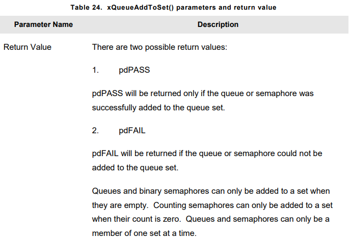
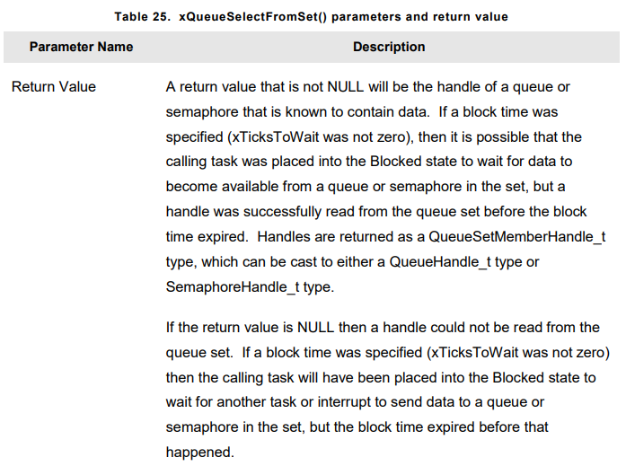

# **QUEUE MANAGEMENT**
- Queues provide **task-to-task**, **task-to-interrupt**, **interrupt-to-task** communication mechanism

## Characteristic of a Queue


### Data Storage

- Queue can hold **finite** number of fixed size data items. Maximum number of items a queue can hold called **length**. Both **length** and **size** are set when queue created.

- Queues are FIFO(First-in, First-Out) buffers.Data written to **end** of(tail) queue, and read from **front**(head) of the queue.


- There are two ways in which queue behaviour could have implemented 
    1. **Queue by copy**        : Data sent to queue is copied byte for byte
    2. **Queue by reference**   : Queue holds only pointers, Not data itself

- Stack variable can be sent directly to queue, even tough the variable will not exist after function it declared exited.

- Data can  be sent to queue without first allocating a buffer to hold data, then copying data to allocated buffer.

- The sending task can immediately re-use the variable or buffer that was sent to buffer.

- The sending and the receiving task are completly de-coupled

- FreeRTOS takes complete responsibility for allocating memory used to store data

- In a memory protected system, the RAM that a task can access will be restricted. By using Queue, the kernel allowing a queue to be used to pass data across memory protection boundaries.

### Access

- Queues are object in their own right that can be accessed by **any task** or **ISR** that knows their existance. **Any** number of task can **write** to same queue, **any** number of task can **read** from the same queue.

- In practice, its very common that queue have **multiple** writers, but much less common for a queue to have **multiple** readers.

### Blocking on Queue Reads
- When a task attempts to read from a queue, it can optionally specify a **block time**. This is the time the task will kept in the **BLOCKED** state to wait for data to be available from the queue, and queue should be empty. When data becomes available, the task automatically moved to **READY** state. Or if data doesnt become available in specified time, again task moved to **READY** state.

- Queues can have multiple readers, so there can be multiple task waiting for data in **BLOCKED** state, When data becomes available only **one** task will be **UNBLOCKED**(moved to ready state). That task is unblocked will always the **highest priority** task been waiting for data. If all prioirities are equal, then the task has been waiting for longest time will be unblocked.

### Blocking on Queue Writes
- A task can optionally specify a **block-time** when writing to queue. **Block-time** is the maximum time that task should held in **BLOCKED** state to wait for space to become available on the queue, and queue should be **full**. 

- Queue can have multiple writers, so it is possible to have multiple task waiting to write in **BLOCKED** state. In this case only **1** task will become **UNBLOCKED** when  spaces become available. The task unblocked is the task which has **HIGHEST** priority. If blocked task have equal priority, then the task been waiting **for longest** time will become **UNBLOCKED**

### Blocking on Multiple Queues
- Queues can be grouped into sets, allowing task to enter **BLOCKED** state to wait for data to become available on any of queues in the **set**.

## Using a Queue
- FreeRTOS allocates RAM from **FreeRTOS Heap** when queue is created. It can hold queue Data structures and items are contained in queue.

- Prototype :
``` C
QueueHandle_t xQueueCreate(UBaseType_t uxQueueLength, UBaseType_t uxItemSize);
```


- After a queue created <code>xQueueReset()</code> API function can be used to return queue to its original empty state.
``` C
BaseType_t xQueueReset( QueueHandle_t xQueue );
```

- **xQueueSendToBack()** API Function is used to send data to **back(tail)** of a queue. **xQueueSend()** is equivalent to and exactly same as, **xQueueSendToBack()**.
- Prototype :
``` C
BaseType_t xQueueSendToBack(QueueHandle_t xQueue, const void *pvItemToQueue, TickType_t xTicksToWait)
```

- **xQueueSendToFront()** API Function used to send data to the **front(head)** of the queue. 
- Prototype :
``` C
BaseType_t xQueueSendToFront(QueueHandle_t xQueue, const void *pvItemToQueue, TickType_t xTicksToWait);
```

- Never call <code>xQueueSendToFront</code> or <code>xQueueSendToBack()</code> from ISR. Interrupt-safe versions are <code>xQueueSendToFrontFromISR()</code> and <code>xQueueSendToBackFromISR()</code>.


- **xQueueReceive** API Function is used to **receive(read)** item from queue. The item that received is removed from the queue. Never call this function from ISR, instead call interrupt-safe version <code>xQueueReceiveFromISR()</code>
- Prototype : 
``` C
BaseType_t xQueueReceive(QueueHandle_t xQueue, void * const pvBuffer, TickType_t xTicksToWait);
```


- **uxQueueMessagesWaiting** API Function is used to query number of items that are currently in the queue. Never call this function from **ISR**, instead interrupt-safe version <code>uxQueueMessagesWaitingFromISR()</code> should be used.

``` C
UBaseType_t uxQueueMessagesWaiting(QueueHandle_t xQueue);
```


## Receivig Data From Multiple Sources
- It is common in FreeRTOS for a task to receive data from more than one source. The receiving task needs to know where the data came from to determine how the data should be processed. An easy design is to use single queue to transfer structures with value and data source information.


## Working with Large or Variable Sized Data
- If the size of data being stored in queue is **large**, then it is preferable to use the queue to transfer pointers to data, rather than copy the data itself into and out of the queue **byte by byte** . Transfering pointers is more efficent in both **proccessing time** and the **amount of RAM** required to create the queue. However queuing pointers, extereme care must be taken, ensuring that
    1. **The owner of RAM being pointed is clearly defined**. Also we must makes sure when sharing data between taks via pointer, both taks shouldn't modify content simultaneously. Ideally sender task should be permitted to access content until pointer has been queued, and only receiver task should be permitted to content after memory content received from queue.

    2. **The RAM being pointed to remains valid** : If the memory being pointed was allocated dynamically, then exactly one task should be responsible for  freeing the memory. No taks should attempt access memory after it has been freed. A pointer should **never** be used to access data that has been allocated on the **task stack**.

- Combining, sending structures to queue and sending pointers t queue is powerfull design pattern.

## Receiving From Multiple Queues

### Queue Sets
- **Queue Set** allow a task to receive data from more than one queue without the task polling each queue in turn to determine which, if any, contains data. Don't use it if not really necessary to use Queue set.
- If a queue is member of a queue set, then do not read data from the queue unless the queues handle has first been read from the queue set. Queue set functionality enabled by macro below in FreeRTOSConfig.h 
``` C
#define configUSE_QUEUE_SETS 1
```

- **xQueueCreateSet()** API Function : A queue set must be explicitly created before it can be used.
- Prototype :
``` C
QueueSetHandle_t xQueueCreateSet(const UBaseType_t uxEventQueueLength);
```


- **xQueueAddToSet()** API Function adds a queue or semaphore to a queue set;
- Prototype :
``` C
BaseType_t xQueueAddToSet(QueueSetMemberHandle_t xQueueOrSemaphore, QueueSetHandle_t xQueueSet);
```



- **xQueueSelectFromSet()** API Function when member of set(queue or semaphore)receives data, the handle of the receiving member sent to Queue set, and when returned when some task calls **xQueueSelectFromSet()**
- Don't read data from queue or semaphore that is member of set **unless** the handle of the queue or semaphore has first been returned from a call to **xQueueSelectFromSet()**. Only read 1 item each time, then you have to call xQueueSelectFromSet again.

- Prototype : 
``` C
QueueSetMemberHandle_t xQueueSelectFromSet(QueueSetHandle_t xQueueSet, const TickType_t xTicksToWait);
```



- In relastic case, Queue set might not hold same data type. Or it might contain both queues and semaphores. When this is the case, it is necessary to test value returned by **xQueueSelectFromSet()** before the returned value is used.


## Using a Queue to Create a Mailbox
- There is no consensus on terminology within embedded community, and **mailbox** will have different meaning in different **RTOS**es. In this book it is used for that **queue has length of 1**.

- A mail box used to hold data that can be read by any task, or any ISR. Mailbox doesnt pass data through, instead data is overwritten. The sender overwrites data in mailbox, receiver reads the value from mailbox but does not remove the value from the mail box.

- **xQueueOverwrite()** API Function is like <code>xQueueSendToBack()</code> function but overwrite function works when queue is already full. **xQueueOverwrite()** should only be used with queues that have a length of **one**.  

- Never call **xQueueOverwrite()** from an ISR. Use Interrupt-safe version, instead use **xQueueOverwriteFromISR()**

- Prototype : 
``` C
BaseType_t xQueueOverwrite(QueueHandle_t xQueue, const void *pvItemToQueue);
```


- **xQueuePeek()** API Function is used to receive(read) an item from a queue without the item being removed from the queue. **xQueuePeek()** receives data from the head of the queue, without modfying the data  stored in the queue.

- Never call xQueuePeek()** from ISR, instead use ISR-safe version : **xQueuePeekFromISR()**

- Prototype : 
``` C
BaseType_t xQueuePeek(QueueHandle_t xQueue, void * const pvBuffer, TickType_t xTicksToWait);
```
