# **SOFTWARE TIMER MANAGEMENT**

## Introduction

- Software timers are used to schedule the execution of a function at a **set time** in the future or periodically with a fixed frequency. The function executed by the software timer is called the software timer's callback function

- Software timers are provided by FreeRTOS kernel, Dont require hardware support, and not related to hardware timers. Software timers don't use any resources, unless their callback function is executing.

- Software timer functionality is optional, In order to use them, have to define macro below in FreeRTOSConfig.h
``` C
#define configUSE_TIMERS 1
```

## Software Timer CallBack Functions
- Software timer callback functions are implemented as C functions.
- Prototype : 
``` C
void ATimerCallback(TimerHandle_t xTimer);
```
- Software timer callback are classic c functions, they must not return anything. They must **not** enter **BLOCKED** state. They must not call any FreeRTOS functions which will put them in **BLOCKED** state. It's okay to call **xQueueReceive()** but **xTicksToWait** parameter set 0. Never call **vTaskDelay()** function.

- Software timer period is between timer being started and their callback function called.

- There are 2 types of software timer.
    1. **One-shot Timer** : Once started, it will execute callback function only once. Need to be restarted manually 
    2. **Auto-reload Timers** : Once started, each time callback function it's executed, it will restart itself. Resulting periodic execution its callback function.

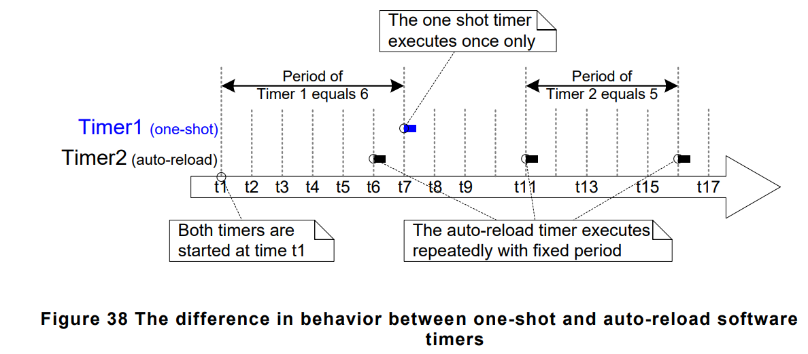
    
- Software timers can be in 2 different states
    1. **Dormant** : It exist, it can be referenced by its handle but its not running. So callback function will not execute 
    2. **Running** : A running software timer will execute its callback function, when its period elapsed.

- **xTimerDelete()** API Function deletes a timer.A timer can be deleted anytime.

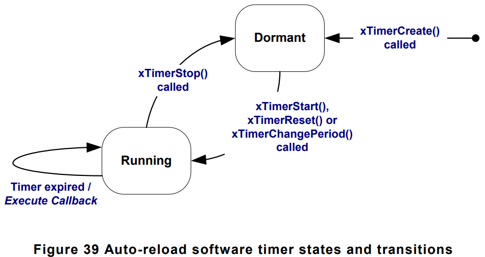

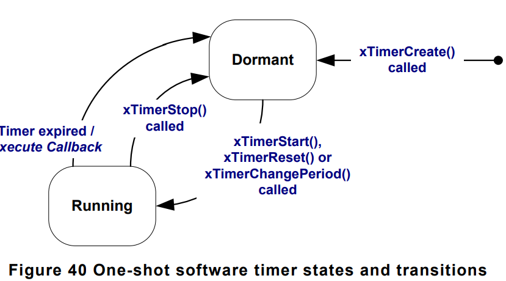

## The Context of Software Timer 

### RTOS Deamon(Timer Service) Task
- All software timer callback functions execute in the context of the same RTOS Deamon task.
- The RTOS Deamon Task is standart FreeRTOS task that created automatically when scheduler started. Its priority and stack size are set by macros below in FreeRTOSConfig.h file
``` C
#define configTIMER_TASK_PRIORITY 
#define configTIMER_TASK_STACK_DEPTH
```

- Software timer API functions send commands from calling the task to DEAMON task on queue called **timer command queue**. Commands include **start a timer**, **stop a timer**, **reset a timer**. The queue is automatically created when scheduler started. The length of queue is set by macro below in FreeRTOSConfig.h file in compile time.
``` C
#define configTIMER_QUEUE_LENGTH
```
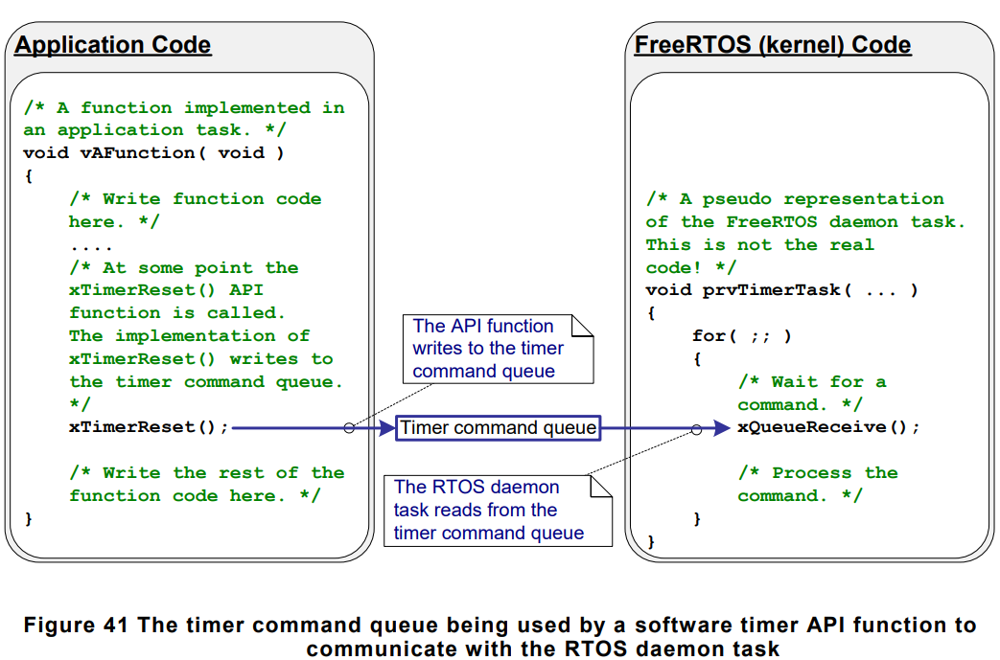

- **DEAMON** task is scheduled like any other FreeRTOS task, it will only process commands, or execute timer callback functions, when its the highest priority task is able to run. Macro below also affect execution pattern of **DEAMON** task.

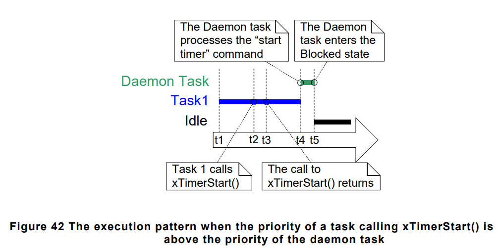

- The time which software timer being started will expire in calculated from when the **start a timer** command was sent. Not from when DEAMON task processed the command from timer command queue.

- Commands sent to timer queue contain timestamp. This makes accurate timing.

- **xTimerCreate()** API Function : A software timer must explicitly created before it can be used. Software timers created in **DORMANT** state. Software timers can be created before scheduler running or from other task before scheduler started.

``` C
TimerHandle_t xTimerCreate(const char * const pcTimerName, TickType_t xTimerPeriodInTicks, UBaseType_t uxAutoReload, void * pvTimerID, TimerCallbackFunction_t pxCallbackFunction);
```
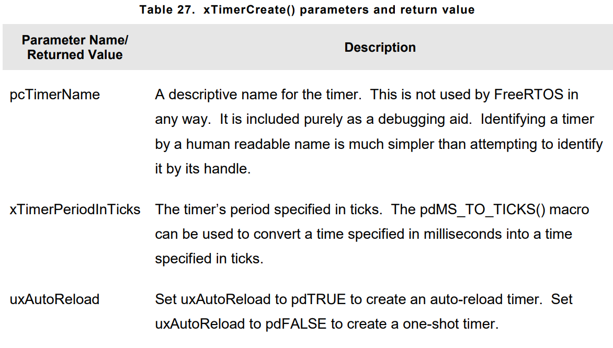
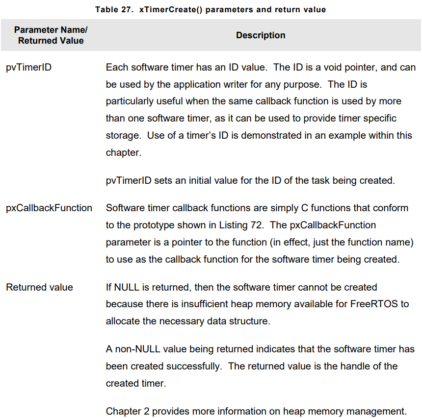

- **xTimerStart()** API Function is used to start software timer that is in **DORMANT** state, or reset(re-start)a software timer in **RUNNING** state.
- **xTimerStop()** is used to stop a software timer that is in **RUNNING** state. Stoping timer, transition timer into **DORMANT** state.
- **xTimerStart()** can be called before scheduler started but timer will start runing after scheduler started. 

- Never call **xTimerStart()** from ISR, instead use interrupt-safe version **xTimerStartFromISR()**

- **xTimerStart()** prototype :
``` C
BaseType_t xTimerStart(TimerHandle_t xTimer, TickType_t xTicksToWait);
```
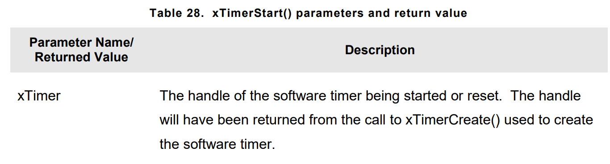
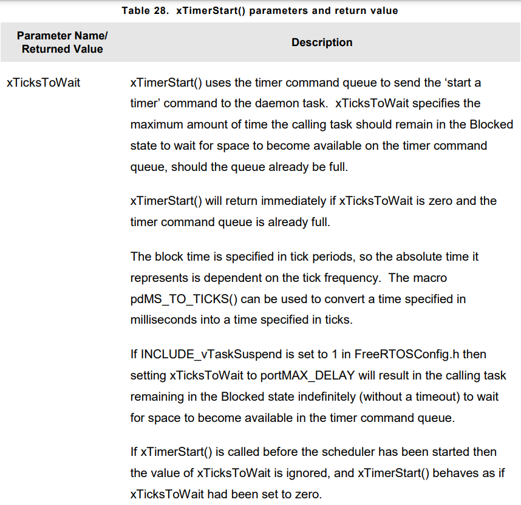
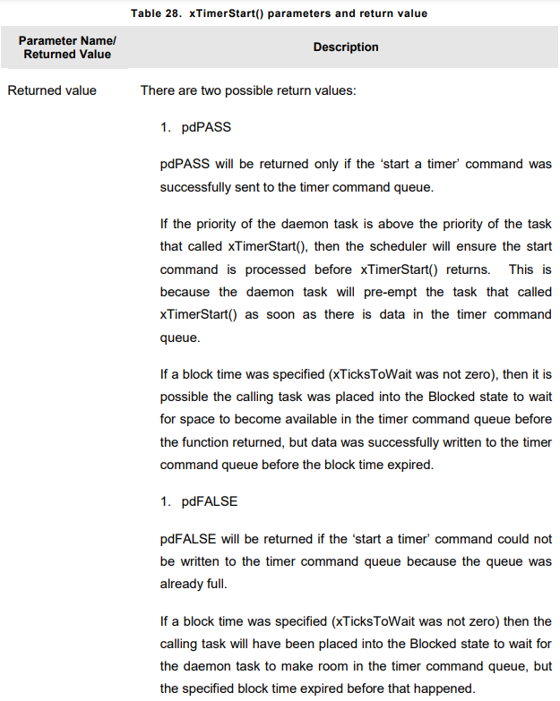


## The Timer ID
- Each software timer has an ID, which is **tag** can be used by application writer for any purpose. it is stored in void pointer(void *).
- An initial value as assigned to the Id when timer is created. After it could be updated with <code>vTimerSetTimerID()</code> and get queried with <code>pvTimerGetTimerID()</code>. This API functions access timers directly, command queue is not used.

- Prototype : 
``` C 
void vTimerSetTimerID(const TimerHandle_t xTimer, void *pvNewID)
```

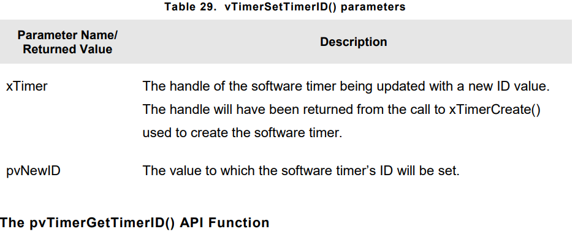

- Prototype : 
``` C
void *pvTimerGetTimerID(TimerHandle_t xTimer)
```

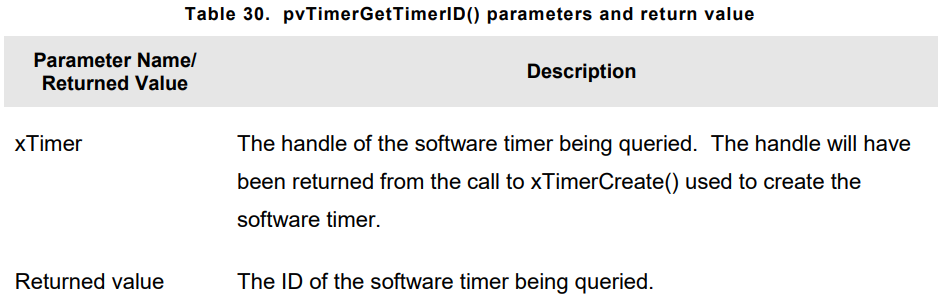

## Changing the Period of a Timer
- **xTimerChangePeriod()** API Function is used to change software timer period. This is used for timer already **RUNNING**. The re-calculated expiry time is relative to when function called, not relative to when timer was started.

- If it is used on timer in **DORMANT** state, then the timer will calculate an expiry time, and transition to **RUNNING** state, 

- Never use <code>xTimerChangePeriod()</code> from ISR, instead use <code>xTimerChangePeriodFromISR()</code>.

- Prototype : 
``` C
BaseType_t xTimerChangePeriod(TimerHandle_t xTimer, TickType_t xNewTimerPeriodInTicks, TickType_t xTicksToWait);
```
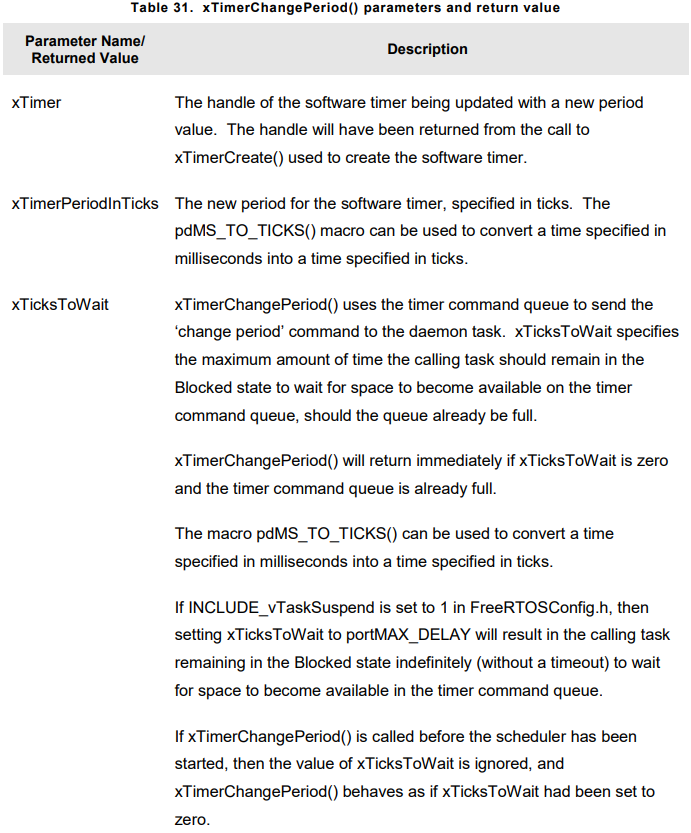

## Reseting a Software Timer

- Reseting software timer means to re-start the timer, timer expiry time is **re-calculated** to when timer was reset, rather than the timer was orginally started.

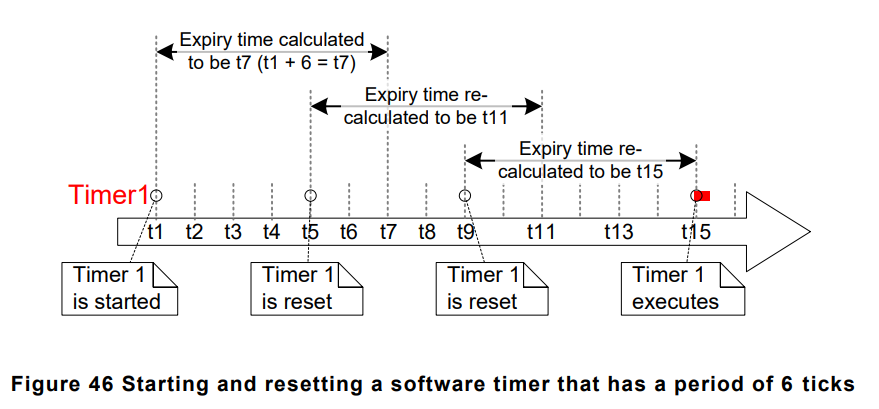

- **xTimerReset()** API function is used to reset timer. It can also used to start timer in **DORMANT** state. Never call **xTimerReset()** from ISR, instead use **xTimerResetFromISR()**.
- Prototype :
``` C
BaseType_t xTimerReset(TimerHandle_t xTimer, TickType_t xTicksToWait);
```

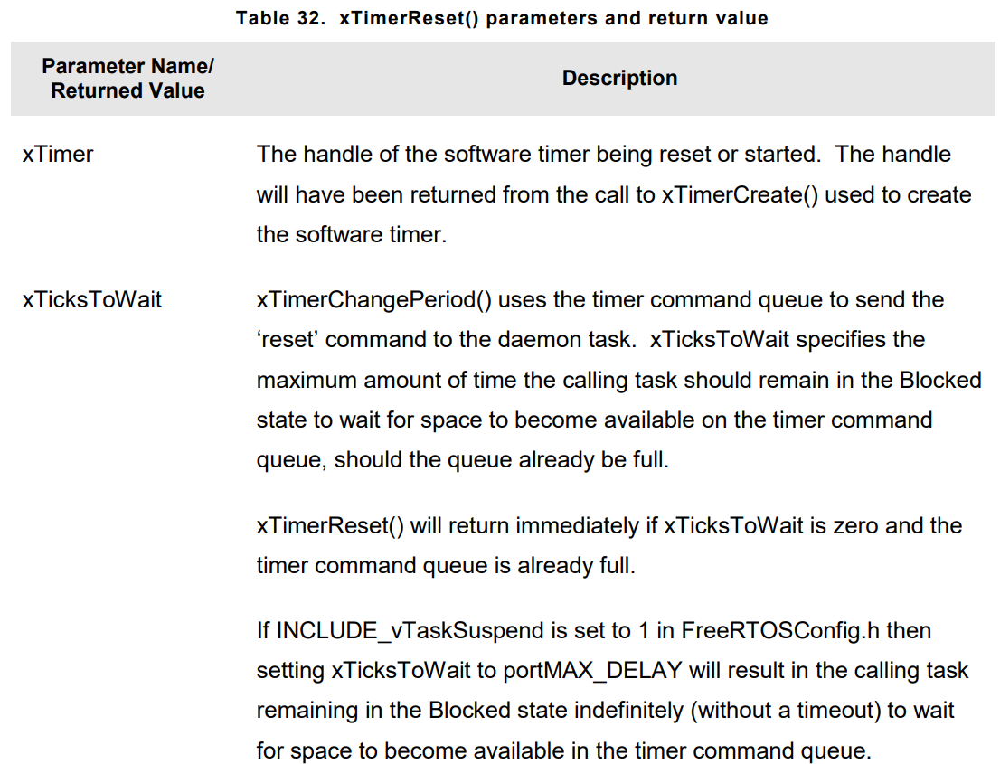
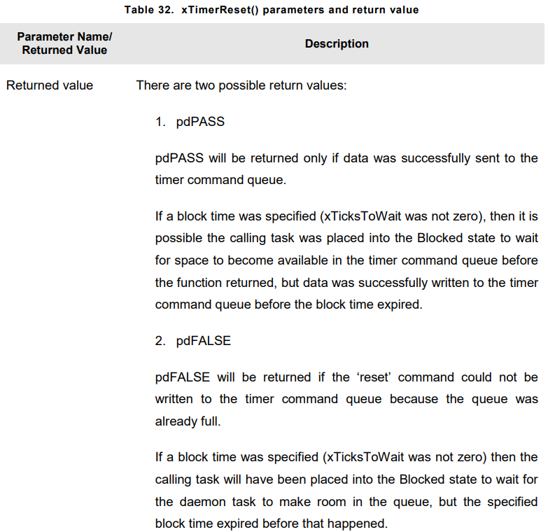


