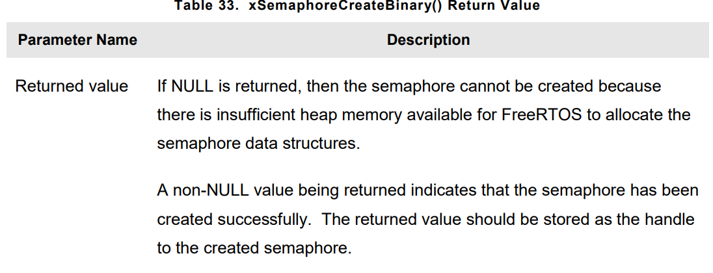

# **INTERRUPT MANAGEMENT**

## Introduction
- Embedded **Real-Time** systems have to take actions in response to events that originate from the enviroment. Important real time systems have to service events that originate from **multiple source**s, all of which have **different processing** overhead and response time requirments.

- Judgement has to be made as to the best event processing implementation strategy
    1. Interupts are normally used, but inputs can also be polled.
    2. When Interrupts are used, **how much** processing should be performed inside **ISR**, how much **outside**, normally it is desired to keep each ISR as short as possible.
    3. How events are communicated to the **main(Non-ISR) code**, how can this code structed to best accommodate processing of asynchronous occurences.

- FreeRTOS **doesn't** impose any specific event processing stragety on application designer, but does features that allow strageties implemented in a simple and maintainable way.

- It is important to draw distinction between the priority of task, and priority of an interrupt.

- A task is software feature is unrelated to hardware which FreeRTOS is running. The priority of task assigned in software and scheduler decides which task will be in **RUNNING** state.

- ISR is hardware feature because hardware controls which ISR will run. Tasks run when there is no ISR running, so **lowest priority** interrupt will interrupt the **highest priority task**. There is no way to pre-empt an ISR.


## Using FreeRTOS API from an ISR
- Often it is necessary to use functionality provided by FreeRTOS API in ISR. but many FreeRTOS API functions are not safe, instead we use **FromISR** version of functionality. 
- Normal functions put ISR Task in **BLOCKED** state, but **FromISR** functions are safe version and they dont put ISR function in **BLOCKED** state.
- Never call a FreeRTOS API function that does not have **FromISR()** in its name from an ISR.

### Benefits of Using a Separate Interrupt Safe API (FromISR versions)
- Allows task code to be more efficent. 
- Makes Interrupt entry simpler.
- Normal API function would need additional logic to determine if its called  from task or ISR. Additional logic making functions larger, more complex and harder to test.

- Each FreeRTOS port would need to provide a mechanism for determining the execution context(task or ISR)

### Disadvantages of Using Separate Interrupt Safe API
- Having two version of some API Functions allows both tasks and ISR to be more efficent, but introduces new problem sometimes it is necessary to call a function that is not part of FreeRTOS API, but makes use of FreeRTOS API, from both task and ISR. In order to solve that problem :
    1. Defer interrupt processing to a task, so API function is only ever called from the context of task.
    2. If you are using a FreeRTOS port that interrupt nesting, then use version that ends **FromISR**.Also this version(**FromISR**) is can be called from task too.

### The xHigherPriorittyTaskWokenParameter
- If **context-switch** is performed(requested) by interrupt, then the task **RUNNING** when the interrupt **exits** might be **different** to the task that was running when the interrupt was entered

- If context-switching requested by interrupt, we must use **pxHigherPriorityTaskWoen** parameter. Interrupt safe API functions have pointer parameter used for this.
- If context switch should be performed, the interrupt safe API function will set <code>*pxHigherPriorityTaskWoken = pdTRUE</code> but before it used for first time, it must be initialized to <code>*pxHigherPriorityTaskWoken = pdFALSE</code> 
- If application writer not use this functionality, context-switch will be remain in the **READY** state until next time the scheduler runs.

- If an ISR calls more than one FreeRTOS API function, then the same variable can be passed as parameters in each API function call, but it need to be initialized first.

- The reasons why **context-switching** do not occur automatically inside the interrupt safe version of API Function
    1. Avoiding unnecessary context switching
    2. Control over the execution sequence
    3. Portability
    4. Efficency
    5. Execution in the RTOS tick interrupt

- **pxHigherPriorityTaskWoken** parameter is optional. If its not required, then set it to **NULL**

### portYIELD_FROM_ISR() and portEND_SWITCHING_ISR() macros
- This marcos are used to request **context-switch** from an ISR. 
- **taskYIELD** is macro that can be called in task to request a context-switch.
- **portYIELD_FROM_ISR()** and **portEND_SWITCHING_ISR()** are both interrupt safe version of **taskYIELD()**, both of them are used in same way and they do samething.
- Prototypes :
``` C
portEND_SWITCHING_ISR(xHigherPriorityTaskWoken);
```

``` C
portYIELD_FROM_ISR(xHigherPriorityTaskWoken);
```

- If <code>xHigherPriorityTaskWoken</code> parameters is **pdFALSE**, then context switch is not requested, and macro has no effect. If its not **pdFALSE** then context switching requested and the task in **RUNNING** state might change.

- Interrupt always returning the fonksiyon they were pre-empted, if context switching is requested, then **context-switcher** goes a head and does the switching.

- Most FreeRTOS ports allow this macros to be called from anywhere in ISR, but some FreeRTOS ports(smaller architecture), allow they can called from very end of ISR.


## Deferred Interrupt Processing
- Normally considered best practice to keep ISRs as short as possible. Reason for this :
    1. Even if tasks have been assigned a very high priority they will only run if not interrupts are being serviced by hardware.
    2. ISR can disrupt(add jitter) both start time, and execution time of task
    3. Depeding on architecture, while servicing interrupt, it might not be possible to accept any new interrupt.
    4. Application writer need to be consider the consequences of resources, variables, peripherals and memory buffers are being accesed by a task and ISR at the same time.
    5. Nesting can increase complexity and reduce predictability.

- An ISR must record cause of interrupt, and clear interrupt. Then any other processing needed can be performed in a task, allowing ISR exit quickly as possible. This is called **deferred interrupt processing**, because we defering processing need to be done in ISR to a Task.

- Deferring interrupt processing to task also allows application writer to prioritize the processing relative to other tasks in the  application, and use all FreeRTOS API functions.


- Deferring processing to a task is most usefull when 
    1. Interrupt processing is not deterministic, meaning it is not known advance how long the processing will take.
    2. When processing require some action that cant be performed inside ISR

## Binary Semaphores Used for Synchronization
- The interrupt safe version of **Binary Semaphore API** can be used to unblock a task each time a particular interrupt occurs, effectively **synchronizing** the task with the interrupt. This allows the majority of the interrupt event processing to be implemented within the syncronized task, only fast and short portion left to ISR. This feature used to **defer** interrupt processing to a task.
- If interrupt processing is particularly time critical, then the priority of deferred processing task can be set to ensure task always pre-empts the other tasks in the system. **portYIELD_FROM_ISR()**, makes sure ISR returns directly to the task which interrupt processing deferred. This has effect of ensuring the entire event processing executes contiguously in time, just as if it was implemented within **ISR** itself


- The deferred task uses a **BLOCKING(take)** call to a semaphore as means of entering **BLOCKED** state to wait for the event to occur. When event occurs, ISR uses **give** operation to same semaphore to unlock the task the required event processing can proceed.

- **Taking a semaphore** and **giving a semaphore** are differenct concept that have different meanning depending on their usage scenario. In interrupt synchronization scenario, binary semaphore can be considered conceptually as a queue with **length of one**. So it could contain item or not, so its binary.

- By calling **xSemaphoreTake()**, the deferred interrupt processing is attempt to read from queue with blocktime, causing the task to enter the **BLOCKED** state if the queue is empty.

- When event occurs, the ISR uses **xSemaphoreGiveFromISR()** function to place a token(the semaphore)into the queue, making queue full. This causes the task to exit the **BLOCKED** state and remove the token, leaving queue empty once more. When task has completed processing, it once more attemps to read from the queue and finding queue empty, re-enters the **BLOCKED** state to wait for the next event.


- **xSemaphoreCreateBinary()** API Function used to create binary semaphore. Semaphore functions are actually macros, not functions.

``` C
SemaphoreHandle_t xSemaphoreCreateBinary(void);
```



- **xSemaphoreTake()** API Function used to receive(obtain), take semaphore. Semaphore can be taken only if its is available. All the various types of FreeRTOS semaphore, except recursive mutexes, can be taken using the **xSemahoreTake()** function. 
- This function must **not** be used from ISR.

- Prototype :
``` C
BaseType_t xSemaphoreTake(SemaphoreHandle_t xSemaphore, TickType_t xTicksToWait)
```


- **xSemaphoreGiveFromISR()** API Function used to give binary and counting semaphore. It is interrupt-safe version of **xSemaphoreGive()**, so it has parameter **pxHigherPriorityTaskWoken**.
``` C
BaseType_t xSemaphoreGiveFromISR(SemaphoreHandle_t xSemaphore, BaseType_t *pxHigherPriorityTaskWoken);
```


- When interrupt occur before handler task finish processing many times, it could cause processing task missing events. In real time systems missing interrupts may have bad consequences. Also when waiting for Semaphore, **In-definite** timeouts are bad practice in real-time applications, because they make it difficult to recover from error. Instead waiting with timeout, it will help task to handle errors.


## Counting Semaphores
- **Binary semaphore** can be thought as queues that have a length of **one**, **counting semaphores** can be though of as queues that have length of **more than one**. Tasks are not interested in data that is stored in the queue, but just **number of items** in the queue. To use counting semaphores, in FreeRTOSConfig.h we should define macro below.
``` C
#define configUSE_COUNTING_SEMAPHORES 1
```
- **Counting Semaphores** are typically used for two things 
    1. **Counting events** : Event handler will give semaphore, each time an event occurs.Causing semaphore count value incremented each **give**. A task will **take** a semaphore each time processes an event, causing the semaphore count value to be decremented on each **take**. The count value is the difference between the number of events that have occured and the number that have been processsed. Counting semaphores that are used to count events are created with initial count 0
    

    2. **Resource Management** : In this scenario, the count value indicates the number of resources available. To obtain control of a resource, a task must obtain semaphore(decrementing the semaphore count.). When count value reach zero, there is no resource available. When task finishes with resource, it **gives** semaphore back, incrementing semaphore count value. Initial count value equals the number of resources that are available.


- **xSemaphoreCreateCounting()** API Function creating counting semaphore.
- Prototype :
``` C
SemaphoreHandle_t xSemaphoreCreateCounting(UBaseType_t uxMaxCount, UBaseType_t uxInitialCount);
```


## Deferring Work to the RTOS Deamon Task
- Previously to deferring interrupts to tasks, we did created tasks for each interrupt. With **xTimerPendFunctionCallFromISR()** API Function we can defer interrupt processing to RTOS Deamon task, Removing the need to create separate task for **each** interrupt. This technique is called **centralized deferred interrupt processing**

- **xTimerPendFunctionCall()** and **xTimerPendFunctionCallFromISR()** API Functions send commands to **DEAMON** task on the timer command queue.

- Advantages of centralized deferred interrupt processing,
    1. Lower resource usage
    2. Simplified user model
- Disadvantages of centralized deferred interrupt processing,
    1. Less flexibility
    2. Less Determinisim
- Different interrupts have different timing constraints, so it is common to use both methods of deferring interrupt processing within the same application.

- **xTimerPendFunctionCallFromISR()** API Function is the interrupt safe version of **xTimerPendFunctionCall()** . Both functions allow a function provided by the application writer to be executed by RTOS **DEAMON** task.
- Prototype : 
``` C
BaseType_t xTimerPendFunctionCallFromISR(PendedFunction_t xFunctionToPend, void *pvParameters1, uint32_t ulParameter2, BaseType_t *pxHigherPriorityTaskWoken);
```


- **vPendableFunction** Function prototype : 
``` C
vPendableFunction(void *pvParameter1, uint32_t ulParameter2);
```


## Using Queues within an Interrupt Service Routine
- Binary and couting semaphores are used to communicate events. Queues are used to communicate events, and transfer data.

- <code>xQueueSendToFrontFromISR</code> is interrupt safe version of <code>xQueueSendToFront()</code>
, <code>xQueueReceiveFromISR()</code> is interrutp safe version of <code>xQueueReceive()</code>

- Prototypes :
``` C
BaseType_t xQueueSendToFrontFromISR(QueueHandle_t xQueue, void *pvItemToQueue, BaseType_t *pxHigherPriorityTaskWoken);
```
``` C
BaseType_t xQueueSendToBackFromISR(QueueHandle_t xQueue, void *pvItemToQueue, BaseType_t *pvHigherPriorityTaskWoken);
```


- To use data streamed to user to our program, using queue may not be efficent. Especially if receiving data is high frequency. We instead use DMA instead of queue. A direct to **task notification** can be used to unlock the task that will processs the buffer.

## Interrupt Nesting
- It is common for confusion to arise between task priorities and interrupt priorities. **Hardware** decides when an ISR will execute, whereas software decides when a task will execute. An ISR executed in response to a hardware interrupt will interrupt a task, but a task cannot pre-empt an ISR

- Ports that support interrupt nesting require one or both of constants detailed in FreeRTOSConfig.h macros below.
``` C
#define configMAX_SYSCALL_INTERRUPT_PRIORITY        (PRIORTY_NUMBER)    // Older ports use this
#define configMAX_API_CALL_INTERRUPT_PRIORITY       (PRIORTY_NUMBER)    // Newer ports use this
```


- Each interrupt source has a numeric priority, and logical priority
    1. **Numeric priority** : Simply the number assigned to interrupt priority
    2. **Logical priority** : Describes that interrupt's precedence over other interrupts. An interrupt can nest any interrupt that has a lower logical priority, but an interrupt cannot nest any interrupt that has an **equal** or **higher** logical priority

- Interrupt numeric priority and logical priority is dependent on the processor architecture, On some processor, the higher the numeric priority assigned to an interrupt the higher logical priority will be, while on the other processor architectures, the higher numeric priority assigned to lower logical priority.

- A full interrupt nesting model is created by setting <code>configMAX_SYSCALL_INTERRUPT_PRIORITY</code> to higher logical interrupt priority than <code>configKERNEL_INTERRUPT_PRIORITY</code>


- Interrupts that use priorities 1 to 3, inclusive, are prevented from executing while the kernel or application is inside **critical section**. ISR running at the priorities can use interrupt-safe FreeRTOS API functions.

- Interrupts that use priority 4, or above, are not affected by critical sections, no nothing the scheduler does will prevent the interrupt from executing immediately.(Within the limitations of the hardware itself). **ISR**s executing at these priorities cannot use any FreeRTOS API functions. Typically, functionality that requires very strict timing accuracy(e.g motor control) would use a priority above <code>configMAX_SYSCALL_INTERRUPT_PRIORITY</code> to use the scheduler does not introduce jitter into the interrupt response time.

- To assist development, FreeRTOS Cortex-M ports check the interrupt configuration, but only if <code>configASSERT()</code> is defined.
- ARM Cortex cores, uses low number for **HIGH** Interrupt Priority, High Number for for **LOW** Interrupt Priority. Cortex-M core allows maximum of 255 interrupt priority, but actual number of bits are implemented is dependent on microcontroller family.

- <code>configKERNEL_INTERRUPT_PRIORTY</code> must always be set to the lowest possible interrupt priority. Cortex-M interrpts will default to priority of zero(Highest possible value). But the Cortex-M hardware does not permit <code>configMAX_SYSCALL_INTERRUPT_PRIORITY</code> to be set to 0. So the priority of interrupt that uses the FreeRTOS API must never be left at its default value.