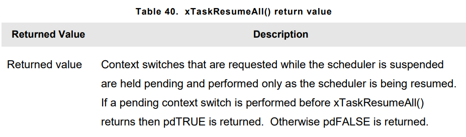
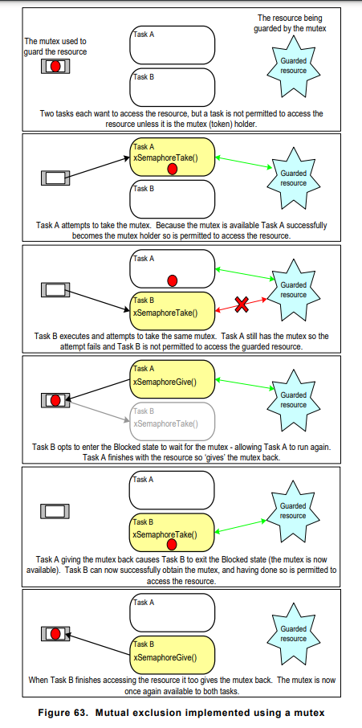
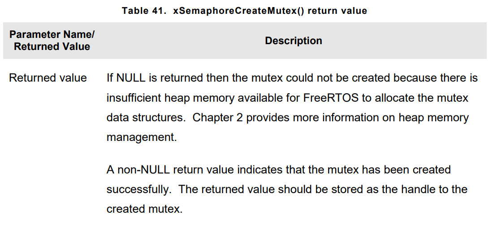
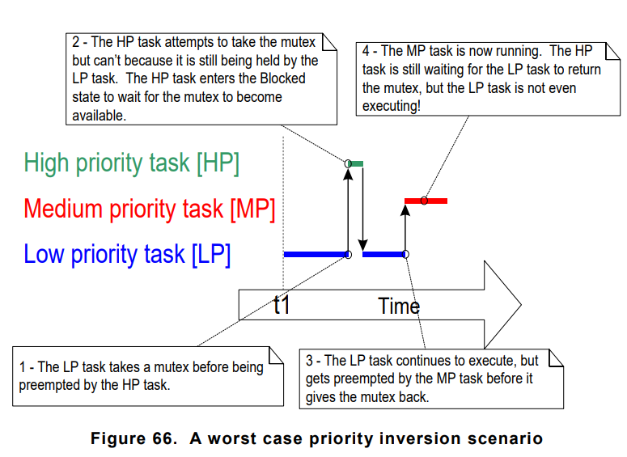

# **RESOURCE MANAGEMENT** 

## Introduction
- In a multi-tasking system, there is potential for error, if one task starts to access a resource, but does not complete its access before being transitioned out of **RUNNING** state. If the task leaves the resource in an inconsistent state, then access to the same resource by any other task or interrupt could result in data corruption.
    1. **Accessing Peripherals** : Accesing same peripheral with 2 task. 
    2. **Read, Modify, Write Operations** : Reading, Modifying or Writing same variable 
    3. **Non-atomic Access to Variables** : (Updating multiple members of structure, updating number large size than architecture register size)
    4. **Function Reentrancy** : Function is called "reentrant" if its safe to call function from more than one task, or from both tasks and interrupts. They are thread safe. If a function does not access any data other than data stored on stack or held in register, then its **reentrant** and **thread-safe**

- **Mutual Exclusion** : To ensure data consistency is maintained at all times  access to a resource that is shared between tasks, or between tasks and interrupts, must be managed using a **mutual exclusion**. The goal is to ensure that, once a task starts to access a shared resource that is not **re-entrant** and not **thread-safe**, the same task has exclusive access to resource until the resource has been returned to a consistent state.

- FreeRTOS provides several features that can be used to implement mutual exclusion but best way to try design application in such a way that resources are not shared, each resource accessed only from a single task.

## Critical Sections and Suspending the Scheduler
- Basic critical sections are regions of code that are surrounded by calls to the macros <code>taskENTER_CRITICAL()</code> and <code>taskEXIT_CRITICAL()</code> respectively. Critical sections are also known as Critical regions.

- They work by disabling interrupts, either completely, or up to the interrupt priority set by <code>configMAX_SYSCALL_INTERRUPT_PRIORITY</code> depending on FreeRTOS port being used.

- Pre-emptive context switches can occur only from within an interrupt, so as long as interrupts remains disabled, the task that called <code>taskENTER_CRITICAL()</code> is guaranteed to remain in the **RUNNING** state until the critical section is exited.

- Critical sections implemented in this way are a very crude method of providing mutual exclusion.

- Basic Critical sections must kept very short, otherwise they will adversely affect interrupt response times. Every call <code>taskENTER_CRITICAL</code> must be closely paired with </code>taskEXIT_CRITICAL</code>

- It is safe for critical sections to become nested, because kernel keeps a count of the nesting depth. The critical section will be exited only when the nesting depth returns to zero.

- <code>taskEXIT_CRITICAL()</code> is executed for every preceding call to <code>taskENTER_CRITICAL()</code>

- <code>taskENTER_CRITICAL()</code> and <code>taskEXIT_CRITICAL()</code> is the only legitimate way for a task to alter interrupt enable state of the processor on which FreeRTOS is running.

- <code>taskENTER_CRITICAL()</code> and <code>taskEXIT_CRITICAL()</code> do not end with "FromISR", so must not be called from ISR. Interrupt safe version is following : 
    1. <code>taskENTER_CRITICAL()</code>    -> <code>taskENTER_CRITICAL_FROM_ISR()</code>
    2. <code>taskEXIT_CRITICAL()</code>     -> <code>taskEXIT_CRITICAL_FROM_ISR()</code>

- The interrupt safe versions are only provided for FreeRTOS Ports that allow interrupts to nest. <code>taskENTER_CRITICAL_FROM_ISR()</code> returns value that must be passed to <code>taskEXIT_CRITICAL_FROM_ISR</code> when done.


### Suspeding(or Locking) the Scheduler
- Critical sections can also be created by suspending the scheduler. Sometimes this is also known as **locking** the scheduler.

- Basic critical sections protect a region of code from access by other taks and by interrupts. But when implemented with suspending the scheduler, **protects a region of code from access by other tasks**, because interrupts meain enabled.

- **vTaskSuspendAll()** API Function : Suspending scheduler, prevents a context switch from occuring, but leaves interrupts **enabled**. If interrupt request context switching while scheduler suspended, request is held pending and performend only when scheduler is resumed(un-suspended). FreeRTOS API Functions must no be called while scheduler is suspended.
- Prototype : 
``` C
void vTaskSuspendAll(void);
```

- **xTaskResumeAll** : The scheduler is resumed(un-suspended) by calling xTaskResumeAll.
- Prototype : 
``` C
BaseType_t xTaskResumeAll(void);
```


- It is safe for calls to <code>vTaskSuspendAll</code> and <code>xTaskResumeAll</code> to become nested, because kernel keeps a counting of the nesting depth. The scheduler will be resumed **only** when the nesting depth returns to zero

## Mutexes(and Binary Semaphores)
- A mutex is a special type of binary semaphore that is used to control access to a resource that is shared between two or more tasks. 

- The word **MUTEX** originates from **MUTual EXclusion0. To use MUTEX, we must define macro below in FreeRTOSConfig.h
``` C
#define configUSE_MUTEXES 1
```

- Mutex can be thought of as a token that is associated with te resourcee being shared. For a task to access the resource legitimately, it must first successfully **take** the token (be token holder).
- When token holder finishes its job, it must **give** the token back. Only when the token has been returned, then another task can take tokens successfully. A task is not permitted to access the shared resource unless it holds the token.

- Difference between binary semaphore and mutex : 
    1. A Semaphore that is used for mutual exclusion must always be returned
    2. A Semaphore that is used for synchronization is normally discarded and not returned.



- This mechanism works purely through disciple of application writer, There is no reason why a task cannot access the resource at any time, But each tasks must be designed in such a way to access resource only when holding the mutex.

- A mutex is type of semaphore

- **xSemaphoreCreateMutex** : It used to create a mutex.
- Prototype :
``` C
SemaphoreHandle_t xSemaphoreCreateMutex(void);
```


### Priority Inversion
- One common pitfalls of using a mutex is could result in priority inversion of tasks. A higher priority task could wait for mutex to be released by lower priority task. This situation called **priority inversion**



- Priority inversion can be a significant problem, but in small embedded systems it can often be avoided at system design time, by considering are accessed.

### Priority Inheritance
- FreeRTOS mutexes and binary semaphores are very similiar.(difference being that mutexes include a basic priority inheritance mechanism, whereas binary semaphores do not).

- Priority inheritance is a scheme that minimizes the negative effects of priority inversion. It doesn't fix priority inversion but merely lessens its impact by ensuring that the inversion is always time bounded. However, priority inheritance complicates system timing analysis, and it is not good practice to rely on it for correct system operation.

- Priority inheritance works by temporarily raising the priority of mutex holder to priority pf the highest priority task that is attempting to obtain the same mutex. It priority automatically resets back to original value when it gives the mutex back.

### Deadlock(or Deadly Embrace)
- Deadlock is another potential pitfall of using mutexes for mutual exclusion. 

- Deadlock occurs when two tasks cannot proceed because they are both waiting for a resources that held by **other**. 

- It is normally **bad practice** fora task to wait infeinietely(without a timeout) to obtain a mutex.

### Recursive Mutexes
- It is also possible for a task to deadlock with itself. This will happen if a task attemps to take the same mutex more than once, without first **returning** mutex. This type of **deadblock**  can be avoided by using **recursive mutex** in place of standart mutex.

- A recursive mutex can be **'taken'** more than once by the same task, and it will returned only after on call to **give** the recursive mutex has been executed for every preceding call to **take** the recursive mutex.

### Mutexes and Task Scheduling
- If two tasks of different priority use the same mutex, then the FreeRTOS Scheduling policy makes the order in which the taks will execute clear. However If tasks are same priority even if the task holding the mutex gives it back, scheduler wont switch context until next time slice.(Assuming scheduler using Time Slicing algorithm)

- If a task uses a mutex in tight loop, and a context switch occured each time the task **gave** the mutex, then the task would only ever remain in **RUNNING** state for short period of time. If two or more tasks used the same mutex in a tight loop then processing time would be wasted by rapidly switching between tasks. 

### Tick Hook(or tick Callback)
- A tick hook (or tick callback) is a function that is called by the kernel during each tick interrupt. To use it macro below must be deifned in FreeRTOSConfig.h
``` C
#define configUSE_TICK_HOOK 1
```
- Prototype : 
``` C
void vApplicationTickHook(void);
```
- Tick hook functions execute within context of the tick interrupt, so it must be kept very short, must use only a moderate amount of stack space, and must not call any FreeRTOS API functions that dont end with '**FROMISR**'


## Gatekeeper Tasks
- Gatekeepr tasks provide a **clean** method of implementing **mutual exclusion** without **risk** of **priority inversion** or **deadlock**

- A gate keeper task is the ownership of the resource. Only gatekeeper task is allowed to access the resource directly. Any other task needing to access the resource can do so only indirectly by using the services of the gatekeeper.

- Gatekeeper task usually assigned a lower priority than the normal tasks. So messages sent to the gatekeeper remain in the queue until both print tasks are in **BLOCKED** state.  In some cases it would be appropriate to assign the gatekeeper a higher priority, so messages get processed immediately, but doing so would be at the cost of the gatekeeper delaying lower priority tasks until it has completed accessing the protected resource. 