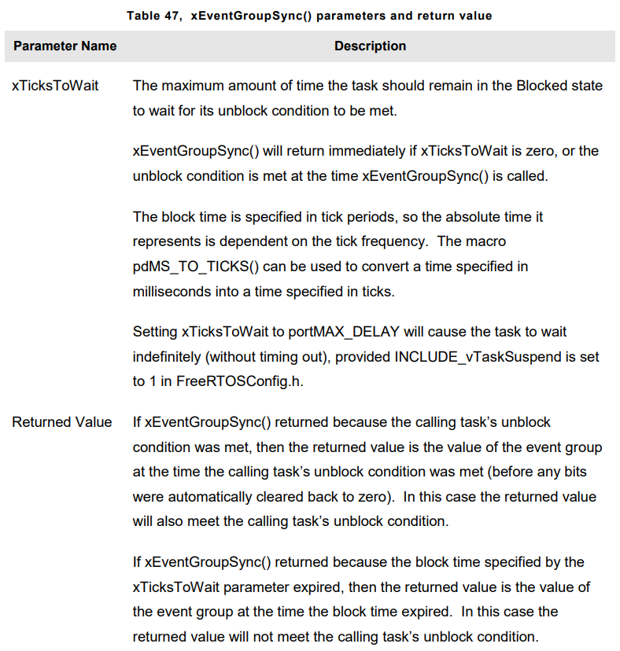

# **EVENT GROUPS**

## Introduction
- Real-time embedded systems have to take actions in response to events. FreeRTOS allows events to be communicates between tasks. (via semaphores, queues..) This properties allow :
    1. Task to wait in the **BLOCKED** state for single event to occur.
    2. They unblock a single task when event occurs.(highest priority event that was waiting)
- Event Groups are another feature of FreeRTOS that allow events to be communicated to tasks, but unlike semaphores and queues,
    1. Event groups allow a task to wait in **BLOCKED** state for combination of one of more events to occur.
    2. Event groups unblock all the tasks that were waiting for the same event, or combination of events, when event occurs

- There features of event groups makes them usefull for **synchronizing** multiple tasks, **broadcasting** events to more than one task, allowing a task to wait in **BLOCKED** state, for any one of set of events occur, and allowing task to wait in **BLOCKED** state for multiple actions to complete.

- Event groups also provide opportunity to reduce RAM usage of application.

- Event Groups is optional. To include it, **event_groups.c** must be build part of FreeRTOS project.

## Characteristic of Event Group
- An event **flag** is a boolean (1 or 0) value used to indicate if an event has occured or not. An event **group** is a set of event flags. An event flag can only be **1** or **0**, allowing state of event flag to be stored in a single bit, and state of all the event flags in event group to be stored in **single** variable. Variable type is **EventBits_t**. 

- If a bit is set to **1** in the **EventBits_t** variable, then the event represented by that bit has occured. If a bit set to **0** in the **EventBits_t** variable, then the event represented by that bit has **not** occured.


- It is up to the application writer to assign a meaning to individual bits within an event group.

- The number of event bits in an event group is dependent on macro below which reside in FreeRTOSConfig.h
``` C
#define configUSE_16_BIT_TICKS 1    // if defined as 1, each event group contains 8 usable event bits.
                                    // if defined as 0, each event group contains 24 usable event bits.       
```

- Event groups can be accessed by any task or ISR that knowns their existence. Any number of tasks can set bits in the same event group, and any number of tasks can read bits from the same event group.

## Event Management Using Event Groups
- **xEventGroupCreate()** API Function is used to create an event group, returns and EventGroupHandle_t type.
- Prototype :
``` C
EventGroupHandle_t xEventGroupCreate(void);
```


- **xEventGroupSetBits()** API Function sets one or more bits in an event group, and is typically used to notify a task that the event represented by the bit, or bits, being set has occured. Never call it from ISR, instead use interrupt-safe version, <code>xEventGroupSetBitsFromISR()</code>

- Prototype :
``` C
EventBits_t xEventGroupSetBits(EventGroupHandle_t xEventGroup, const EventBits_t uxBitsToSet);
```


- Giving semaphore is a deterministic operation because it is known in advance that giving a semaphore can result at most one task leaving **BLOCKED** state. When bits are set in an event group, it is not known in advance how many tasks will leave the **BLOCKED** state, so setting bits in an event group is not deterministic operation.

- FreeRTOS design and implementation standart does not permit non-deterministic operations to be performed inside an ISR, or when interrupts are disabled. xEventGroupSetBitsFromISR does not set event bits directly inside ISR, but instead defers action to RTOS DEAMON Task.
- Prototype :
``` C
BaseType_t xEventGroupSetBitsFromISR(EventGroupHandle_t xEventGroup, const EventBits_t uxBitsToSet, BaseType_t *pxHigherPriorityTaskWoken);
```


- **xEventGroupWaitBits()** API Function allows task to read the value of event group, and optionally wait in the **BLOCKED** state for one or more event bits in the event group to become set, if the event bits are not already set.
- Prototype :
``` C
EventBits_t xEventGroupWaitBits(const EventGroupHandle_t xEventGroup, const Event_t uxBitsToWaitFor, const BaseType_t xClearOnExit, const BaseType_t xWaitForAllBits, TickType_t xTicksToWait); 
```

- The condition used by the scheduler to determine if a task will enter **BLOCKED** state, and when task will leave **BLOCKED** state, is called the **unblock** condition. The unblock condition is specified  by combination of the **uxBitsToWaitFor** and **xWaitForAllBits** parameter values. 
    1. **uxBitsToWaitFor** specifies which event bits in the event group to test
    2. **xWaitForAllBits** specifies whether to use a bitwise **OR** test, or a bitwise **AND** test.

- A task will not enter the **BLOCKED** state if its unblock condition is met at the time <code>xEventGroupWaitBits</code> is called.

- Event bits can be cleared using the <code>xEventGroupClearBits()</code> API Function, but using that function to manually clear event bits will lead to race conditions in the application code if,
    1. There is more than one task using the same event group
    2. Bits are set in the event group by a different task, or by an interrupt service routine.

- **xClearOnExit** parameter is provided to avoid these potential **race conditions**. If **xClearOnExit** is set to **pdTRUE**, then testing and clearing of event bits appears to the calling task to be an atomic operation(uninterruptable by other tasks or interrupts.)


## Task Synchronization Using an Event Group
- Sometimes the design of an application reqiures two or more tasks to synchronize with each other. 

- Event group can be used to create a synchronization point
    1. Each task that must participate in the synhronization is assigned a unique event bit within the event group.
    2. Each task sets its own event bit when it reaches the synchronization point
    3. Having set its own event bit, each task blocks on the event group to wait for the event bits that represent all the other synchronizing tasks to also become set.

- However **xEventGroupSetBits()** and **xEventGroupWaitBits()** API Functions cant be used. Instead **xEventGroupSync()** API Function is used

- **xEventGroupSync()** API Function provided to allow two or more tasks to use an event group to synchronize with each other. Allows a task to set one or more event bits in an event group, then wait for combination of event bits to become set in same event group, as single uniterruptable operation.

- Prototype : 
``` C
EventBits_t xEventGroupSync(EventGroupHandle_t xEventGroup, const EventBits_t uxBitsToSet, const EventBits_t uxBitsToWaitFor, TickType_t xTicksToWait);
```


