# **TASK NOTIFICATIONS**

## Introduction

- FreeRTOS applications are structured set of **independent** tasks, and it is likely these tasks will have to communicate with each other.
- Example of communication objects include **queues**, **event groups**, and various different types of **semaphores**

- When a communication object is used, events and data are not sent directly to receiving task, or receiving ISR, but instead sent to communication object. Likewise tasks and ISR receive events and data from communication object, rather than directly task or ISR that sent the event or data.

### Task Notifications
- **Task Notification** allow tasks to interact with other tasks, and synchronize with ISR without need of communication object. Task notification, a task or ISR can send an event directly to receiving task.
- Task notification functionality is optional. To allow enable task notification macro below must be defined in FreeRTOSConfig.h
- Communication object are **queues**, **semaphores** or **event group**
``` C
#define configUSE_TASK_NOTIFICATION 1
```

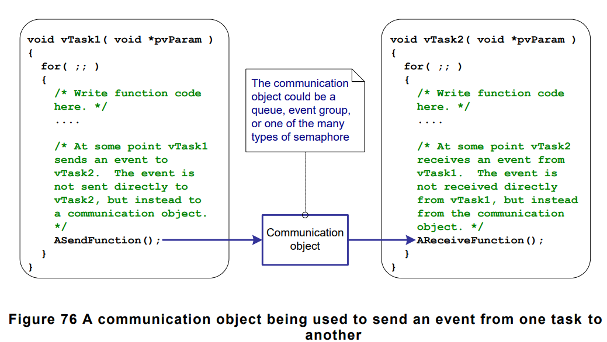


- Each task has **Notification State** which can be either **PENDING** or **NOT-PENDING** and a **NOTIFICATION VALUE** which is uint32_t type. When task receives a notification, its notification state is set to pending, When a task **reads** its notification value, its notificatin state is set to not-pending.
- A task can wait in **BLOCKED** state, with an optional time out, for its notification state to become pending.

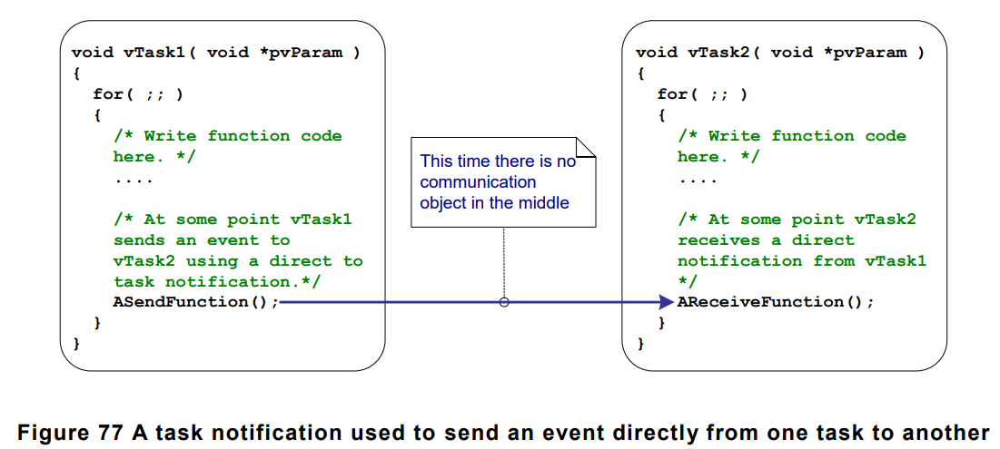

## Task Notifications, Benefits and Limitations
- Task notification to send an event or data to task is significantly **faster** than using a **queue**, **semaphore**, or **event group** to perform an equivalent operation.

- Using a task notification to send an event or data to a task requires significantly **less** RAM than using **queue**, **semaphore**, or **event_group** to perform an equivalent operation. Because each communication object(queue, semaphore, event_group) must be created before it can be used, whereas enabling task notification functionality has a fixed overhead of just **eight** bytes of RAM per task. 

- But task notifications cannot be used in all scenarios. Limitations of Task notifications :
    1. **Sending an event or data to an ISR** : Communication objects can be used to send **event** and **data** from an ISR to a task, and from a task to an ISR. Task notifications can be used to send **event** and **data** from ISR to a task, but they **cannot** be used to send **events** or data **from** a task to an ISR.
    2. **Enabling more than one receiving task** : A communication object can be accesssed by **any task** or ISR that knows its handle. Any number of tasks and ISRs can process **events** or **data** sent to any given communication object. Task notifications are sent directly to the receiving task, so can **only** be processed by the task to which the notification is sent.
    3. **Buffering multiple data items** : Task notifications send data to a task by updating receiving task's notification value. Task notification value can **only** hold one value at a time.
    4. **Broadcasting to more than one task** : Task notifications are sent directly to the receiving task, so can only be processed by the receiving task.
    5. **Waiting in the blocked state for a send to complete** : If a task attempt to send a task notification to a task that already has been notification pending, then it is **not** possible for the sending task to wait in **BLOCKED** state for receiving task to reset its notification state.

## Using Task Notifications
- Task notifications are so powerfull. **xTaskNotify()** to send,  and **xTaskNotifyWait()** to receive function can be used.
- Simpler version of **xTaskNotify()** is **xTaskNotifyGive()**
- Simpler version of **xTaskNotifyWait()** is **ulTaskNotifyTake()**

- **xTaskNotifyGive()** API Function is used to **send** notification directly to a task, and **increments** the receiving tasks notification value. Calling **xTaskNotifyGive()** will set the receiving task notification state to **PENDING**, if it was **not** already pending. This function provided to allow a task notification to be used as a ligher weight and faster alternative to a binary or counting semaphore
- Prototype :
``` C
BaseType_t xTaskNotifyGive(TaskHandle_t xTaskToNotify);
```
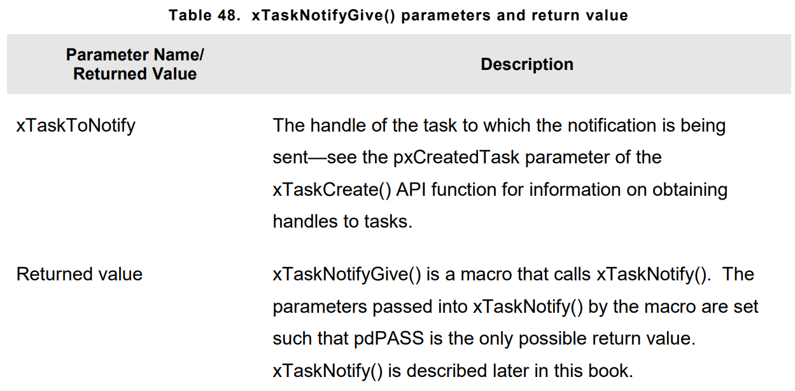

- **vTaskNotifyGiveFromISR()** is interrupt safe-version of **xTaskNotifyGive()** that can be used in an ISR.
- Prototype :
``` C
void vTaskNotifyGiveFromISR(TaskHandle_t xTaskToNotify, BaseType_t *pxHigherPriorityTaskWoken);
```
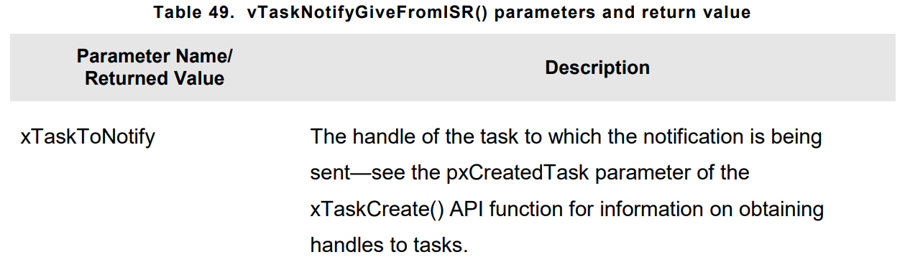
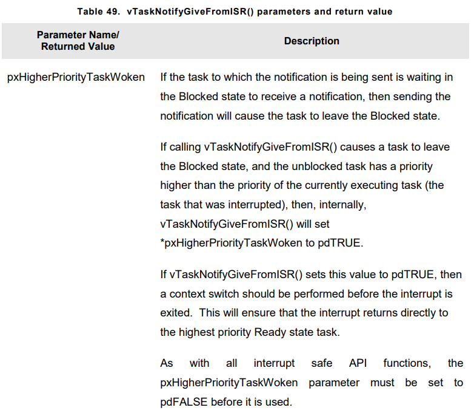

- **ulTaskNotifyTake()** API Function allows a task to wait in **BLOCKED** state for its notification value to be **greater** than zero, either **decrements**(substracts one from) or **clears** the task notification value before it returns. It is provivded to allow a task notification to be used as lighter weight and faster alternative to a binary or counting semaphore.
- Prototype : 
``` C
uint32_t ulTaskNotifyTake(BaseType_t xClearCountOnExit, TickType_t xTicksToWait);
```
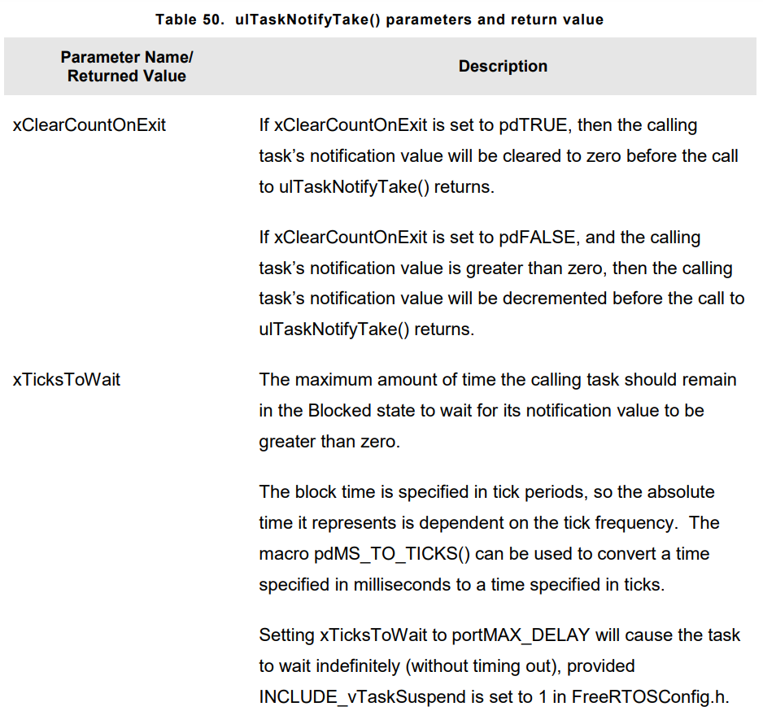
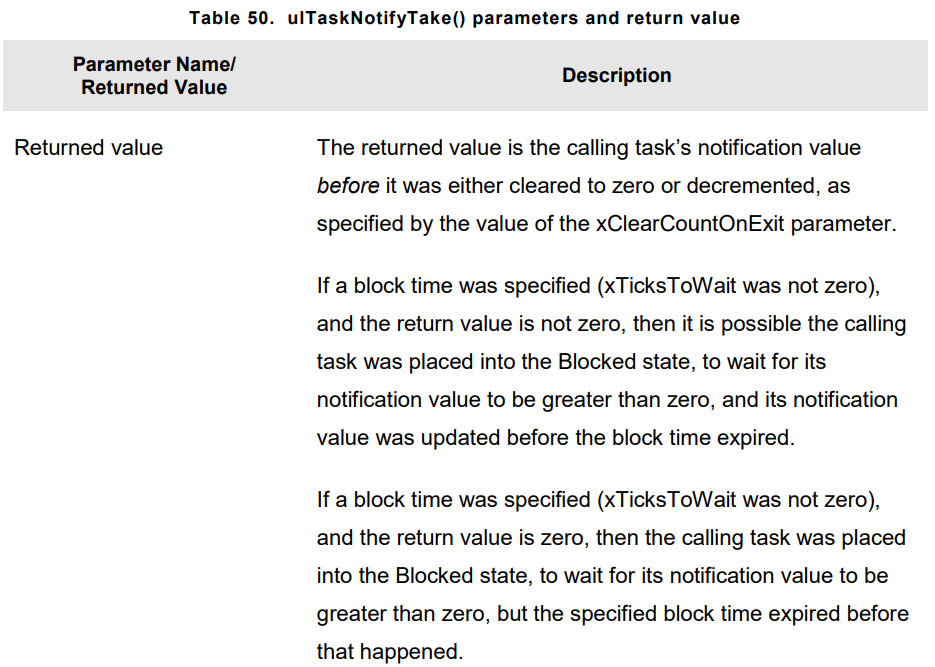

- Notification events that occurs between calls to **ulTaskNotifyTake()** are latched in the task notification value and calls to **ulTaskNotifyTake()** will return immediately if the calling task already has notifications pending.

### The xTaskNotify and xTaskNotifyFromISR() API Functions
- **xTaskNotify()** is a more capable version of **xTaskNotifyGive()** that can be used to update receiving task's notification value in any of the following ways.
    1. Increment(add one) the receiving tasks notification value, Which both functions are capable
    2. Set one or more bits in receiving tasks notification value. This allows a task notification value to be used as lighter weight and faster alternative to an event group
    3. Write completely new number into the receiving task notification value, but only if the receiving task has read it its notification value since it was last updated. This allows task notification value to provide similiar functionality that provided by queue that has length of one.
    4. Write a completly new value into receiving task notification value, even if the receiving task has not read its notification value since it was last updated. This allows a task notification value to provide similiar functionality that provided by the **xQueueOverwrite()** API Function. This sometimes refered as **mailbox**
    5. **xTaskNotify()** is more flexible and powerfull than **xTaskNotifyGive()** but its little more complex. **xTaskNotifyFromISR()** is safe version could be used from ISR.
    6. Caliing **xTaskNotify()** will always set the receiving task notification state to **PENDING**, if it was not already pending.

- Prototype :
``` C
BaseType_t xTaskNotify(TaskHandle_t xTaskToNotify, uint32_t ulValue, eNotifyAction eAction);
BaseType_t xTaskNotifyFromISR(TaskHandle_t xTaskToNotify, uint32_t ulValue, eNotifyAction eAction, BaseType_t *pxHigherPriorityTaskWoken);
```
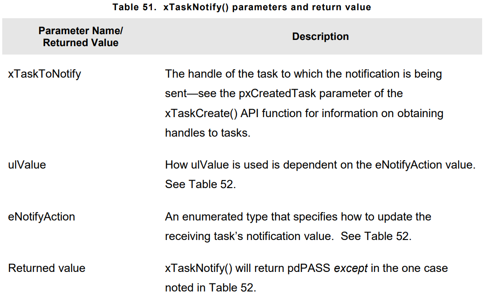
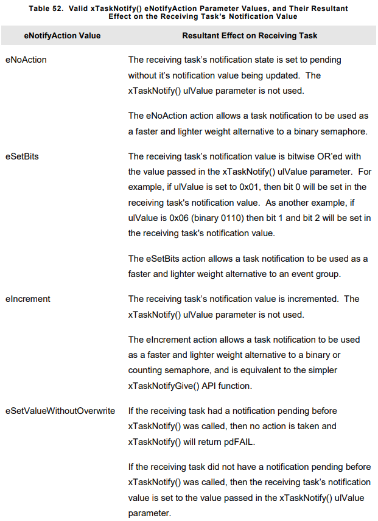
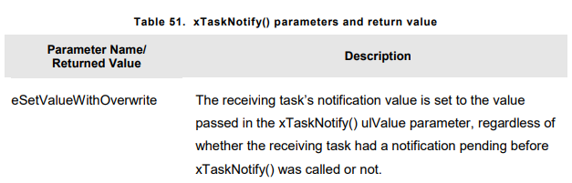


- **xTaskNotifyWait()** API Function is **more** capable version of **ulTaskNotifyTake()**. It allows task to wait with an optional **timeout**, for the calling task notification state to become **PENDING**,  should it not already be pending. It provides options for bits to be cleared in the calling task notification value both on entry to the function and on exit from function.
- Prototype :
``` C
BaseType_t xTaskNotifyWait(uint32_t ulBitsToClearOnEntry, uint32_t ulBitsToClearOnExit, uint32_t *pulNotificationValue, TickType_t xTicksToWait);
```
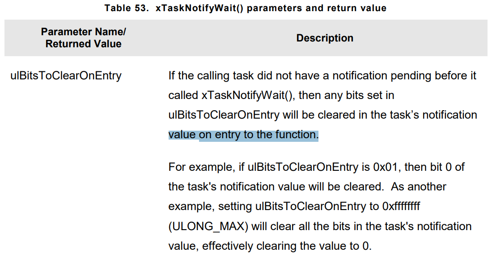
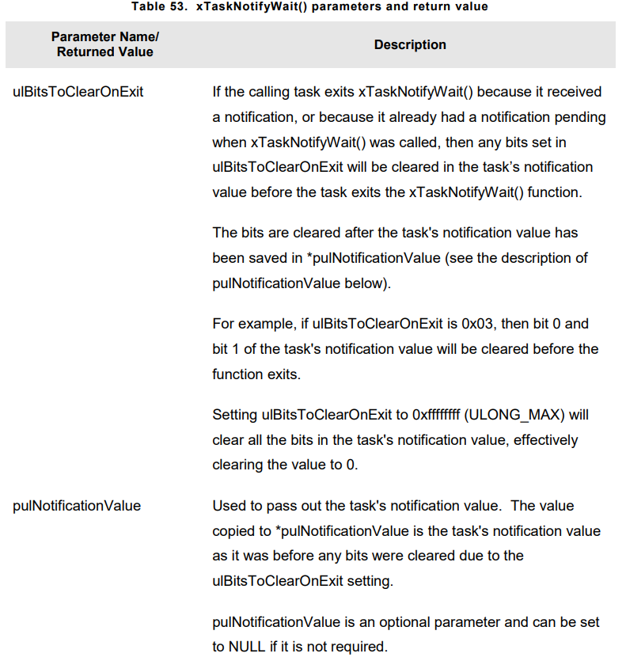
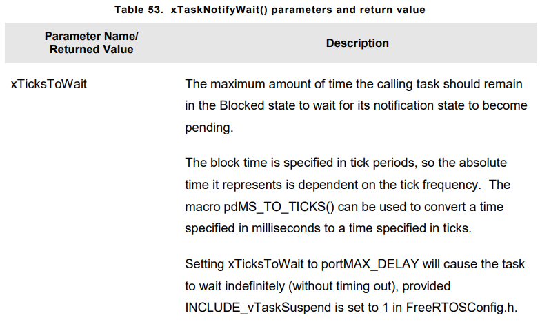
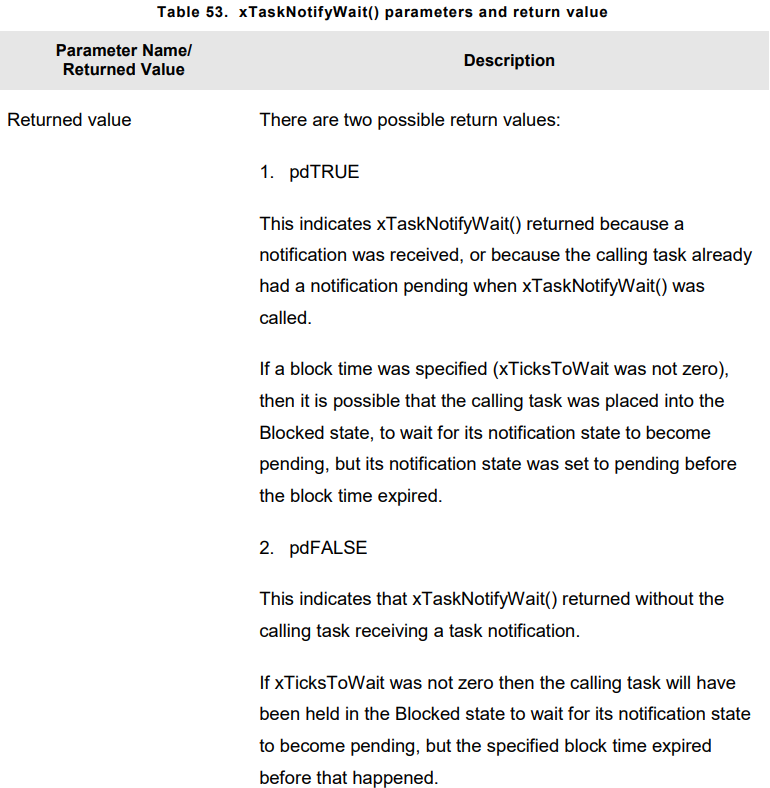

- If a library uses task notifications, then the library documentation must clearly state that calling a library function can change the calling task notification state and notification value.
- Since semaphores are general purpose solution, their RAM footprint is large, processing overhead is unnecessary, but task notifications provide light weight solution to problem.

### Task Notification used in UART Device Drivers
- Some operation on peripherals takes a relatively long time to complete. Example : Large packet of data transmiting on UART, ADC high precision conversion etc..
- Polling could be used to check peripheral status but just wasting CPU Time for nothing. Efficent way to do it is , writing RTOS aware device driver should be interrupt driven.
- It is common practice for RTOS aware driver libraries to use a binary semaphore to place tasks into **BLOCKED** state. If we also want to use mutex, it should be written by application written.
- Task notifications can also replace semaphores in receive functions.

- Realistic implementation of task notification could be some task receive data via queue and turns notification for those commands received via queue.

